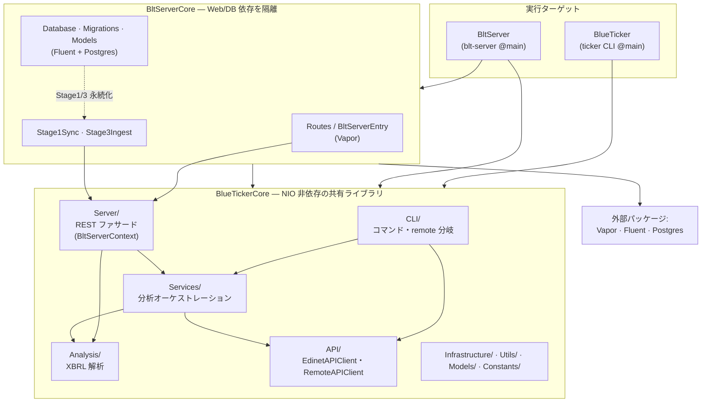
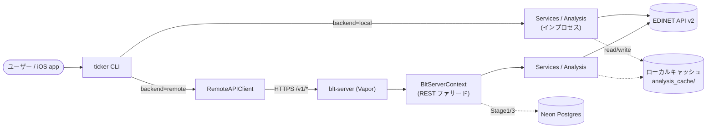
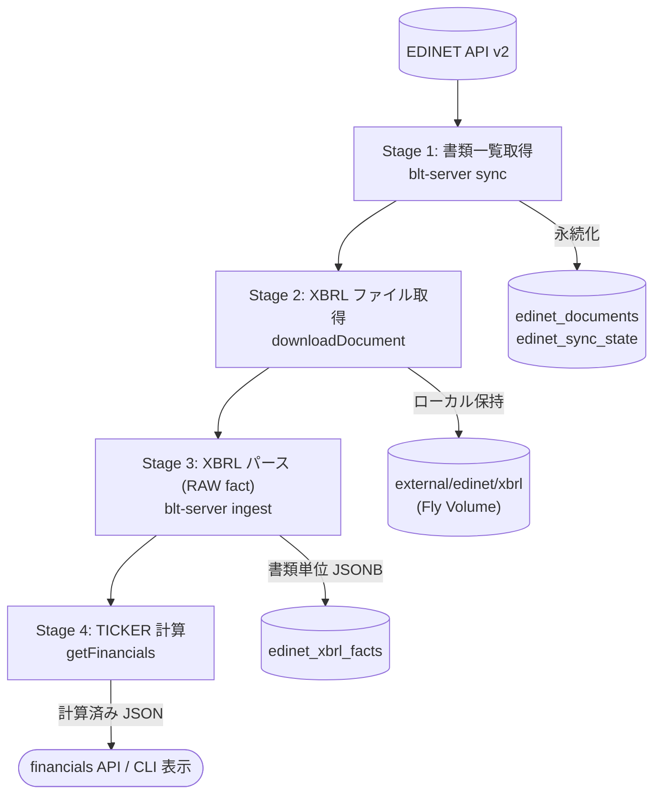
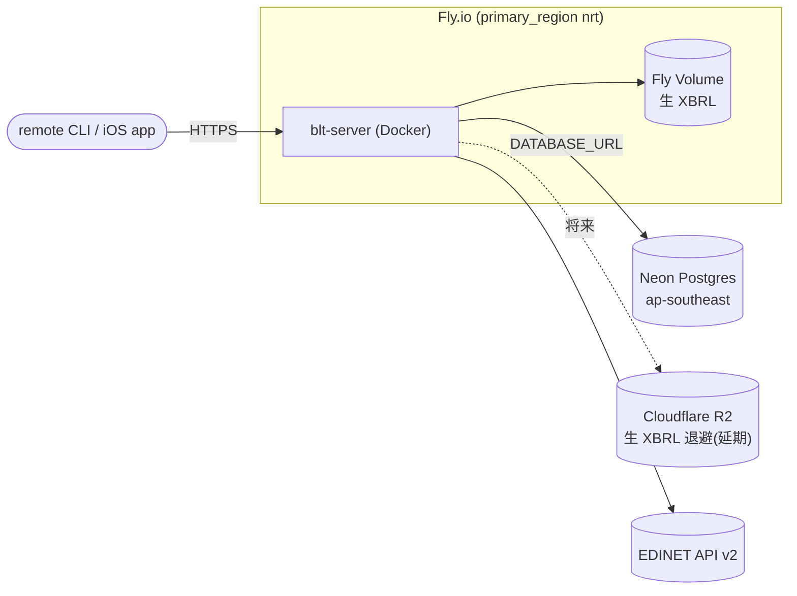

# システムアーキテクチャ

BLUE TICKER の全体構成。現在地のスナップショットであり、計画・履歴はロードマップ（`blt-server-roadmap.md`）と Git に置く。

## デプロイモード

CLI は同一バイナリのまま、設定（`edinet-backend`）で接続先を切り替える。

| モード | EDINET を叩くのは | blt-server | 状態 |
|---|---|---|---|
| **local** | CLI 自身 | なし | 現行稼働中 |
| **remote (self-host)** | blt-server | 同一マシン | 基盤実装済み |
| **remote (cloud)** | blt-server | Fly.io (nrt) + Neon | 配線済み・実 Neon E2E 待ち |

## ターゲット構成と依存方向

`ticker` CLI に Web/DB 依存（Vapor/Fluent/NIO）をリンクさせないため、トランスポート層を `BltServerCore` に隔離する。依存は一方向（`BltServerCore` → `BlueTickerCore`、逆流不可）。

依存ルール（同一モジュール内は import 方向をレビューで担保）:

- `Services/` は `CLI/` を参照しない
- `Analysis/` `API/` `Infrastructure/` `Utils/` は `CLI/` `Services/` `Server/` を参照しない
- `Server/` は REST ファサードのみ（Vapor/Fluent は `BltServerCore` 側）

## リクエストフロー（local / remote）

CLI 各コマンドは `run()` 冒頭で `RemoteBackend.clientIfEnabled()` を呼び、非 nil なら remote 経路、nil なら local 経路へ分岐する。**財務指標の計算（Stage 4）はどちらの経路でもサーバー相当の Core ロジックが行い、表示は CLI が担う**。

接続情報の解決順位: env（`BLT_SERVER_URL` / `BLT_AUTH_TOKEN`）> config。認証は `BLT_AUTH_TOKEN` 設定時のみ `/v1` 配下に Bearer を要求（未設定なら self-host 向けに無認証起動）。

### REST エンドポイント（`/v1/`、公開契約）

| メソッド・パス | ファサード | 用途 |
|---|---|---|
| `GET /healthz` | — | ヘルスチェック（認証不要） |
| `GET /v1/companies?q=` | `searchCompanies` | 企業検索 |
| `GET /v1/sectors/{sector}/companies` | `searchBySector` | セクター別企業 |
| `GET /v1/companies/{code}/filings` | `getFilings` | 提出書類一覧 |
| `GET /v1/companies/{code}/financials` | `getFinancials` | 計算済み財務指標（Stage 4） |
| `GET /v1/companies/{code}/filing-content` | `getFilingContent` | 有報セクション本文・セグメント |

レスポンス契約は単一の Codable 型から導出（`Models/FinancialsContract.swift`）。エラー封筒は `{"error":..., "status":N}`。

## データパイプライン（Stage 1〜4）

EDINET → 計算済み JSON までの 4 段。Stage 4 はサーバー計算に集約し、クライアントは表示に専念する。

| Stage | 保存先 | 状態 |
|---|---|---|
| 1 書類一覧 | DB（`edinet_documents` / `edinet_sync_state`） | スキーマ・`sync` 実装済み |
| 2 XBRL ファイル | ローカル保持（Stage 4 が生 HTML を要するため即削除不可） | `ingest` から取得・保持 |
| 3 XBRL パース | DB（`edinet_xbrl_facts`・書類単位 JSONB） | スキーマ・`ingest` 実装済み・Stage 4 読みは未配線 |
| 4 TICKER 計算 | サーバー計算（インプロセス） | 実装済み（現状は再パース、DB 読みは未配線） |

Stage 3 RAW はサーバー内部の中間生成物で非公開。公開するのは Stage 4 の計算済み財務サマリのみ。

## キャッシュとデプロイ

ローカルキャッシュは取得物（`external/`）と生成物（`derived/`）に分離（詳細は `caching.md`）。

- compute / TLS / secrets / scheduler: **Fly.io**（self-host も同一 Docker イメージ）
- DB: **Neon**（serverless Postgres、`DATABASE_URL` 未設定ならステートレス EDINET プロキシとして起動）
- オブジェクトストレージ: **Cloudflare R2**（Stage 2 退避先、容量問題化まで延期）

詳細・残タスクは `blt-server-roadmap.md`、XBRL 解析仕様は `xbrl-parsing.md`、デプロイ手順は `deploy.md` を参照。
