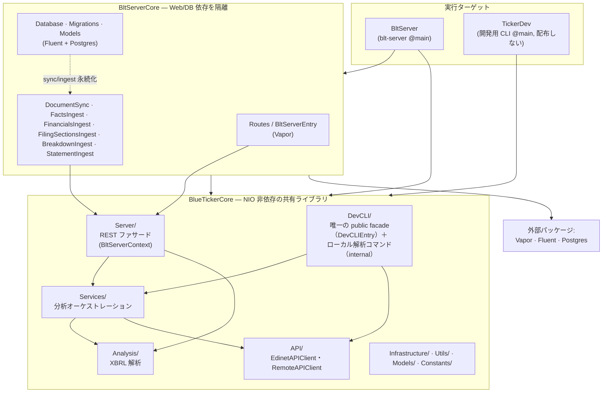
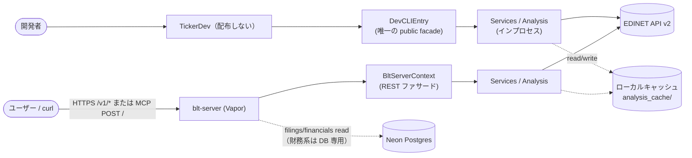
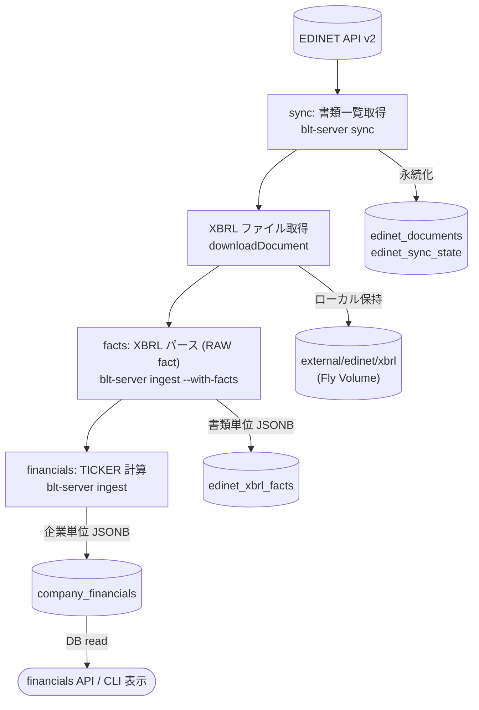
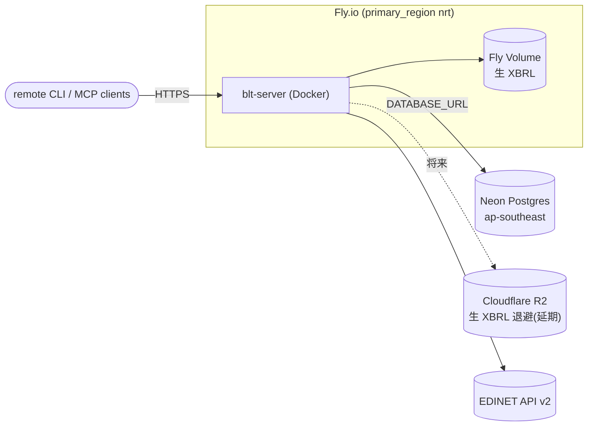

# システムアーキテクチャ

BLUE TICKER の全体構成。現在地のスナップショットであり、計画・履歴はロードマップ（`blt-server-roadmap.md`）と Git に置く。

## デプロイモード

配布 CLI `ticker` は廃止済み。ユーザー接点は REST / MCP。EDINET を直接叩くローカル解析は、配布しない開発用 CLI `TickerDev`（`swift run TickerDev` でのみ実行。`Package.swift` の `products` に含めない）が担う。

| モード | EDINET を叩くのは | blt-server | 状態 |
|---|---|---|---|
| **開発用ローカル解析（`TickerDev`）** | `TickerDev` 自身 | なし | 配布しない。デバッグ・テスト・フィクスチャ専用 |
| **remote (self-host)** | blt-server | 同一マシン | 基盤実装済み |
| **remote (cloud)** | blt-server | Fly.io (nrt) + Neon | **本番** |

> **方針（2026-06-28 確定・2026-07-16 実施）**: ユーザー向けは remote（cloud）へ集約済み。**`ticker` からローカル分析経路（`backend=local` 設定）を撤去**し、EDINET 直叩きロジックは `Sources/BlueTicker/DevCLI/`（`BlueTickerCore` 内・internal）へ移設、唯一の public facade `DevCLIEntry`（`Server/BltServerFacade.swift` と同型のナロー facade）経由で `TickerDev` ターゲットから呼ぶ。完了記録は `blt-server-roadmap.md`「ローカル CLI 廃止ゲート」。
>
> **クライアント面（2026-07-23）**: **REST `/v1` が契約の正**。MCP はそれを写す追従面（一過性とみなす）。配布 `ticker` は**廃止済み**（`TickerDev`・`blt-server` 運用 CLI は残す）。Access SSO はユーザー介在クライアント向けに維持。本番機械到達は Access Service Token（`docs/api-auth.md`）。構想は `docs/public-api-concept.md`。互換は `docs/api-compatibility.md`。

## ターゲット構成と依存方向

Core に Web/DB 依存（Vapor/Fluent/NIO）をリンクさせないため、トランスポート層を `BltServerCore` に隔離する。依存は一方向（`BltServerCore` → `BlueTickerCore`、逆流不可）。

`Package.swift` の `products` には `blt-server`（`BltServer`）のみを載せる。`TickerDev` は products 非搭載（`swift run TickerDev` のみ）。配布 `ticker` と Homebrew release パイプラインは廃止済み。

依存ルール（同一モジュール内は import 方向をレビューで担保）:

- `Services/` は `DevCLI/` のコマンド型を参照してはならない
- `Analysis/` `API/` `Infrastructure/` `Utils/` は `Services/` `Server/` `DevCLI/` を参照してはならない
- `Server/` は REST ファサードのみ（Vapor/Fluent は `BltServerCore` 側）
- `DevCLI/` は `Server/` と同型のナロー facade パターン: `TickerDev` ターゲットへ渡す public 面は `DevCLIEntry` の1点のみ。ローカル解析コマンド実装自体は internal のまま `DevCLI/` に置く（`Services/`・`Analysis/` 等の内部型を新たに public 化しない）

## リクエストフロー（REST / TickerDev）

クライアント（curl / MCP）は blt-server の REST（または MCP）を叩く。**財務系（financials）の計算は ingest（`blt-server ingest`）時に Core ロジックが実行して DB へ格納し、serving は格納済み結果を読むだけ（read-only。未格納は 404・ライブ計算へフォールバックしない）**。EDINET を直接叩く経路は `TickerDev`（配布しない開発用 CLI）のみが持ち、`DevCLIEntry`（`BlueTickerCore` 内の唯一の public facade）経由で同じ Core ロジックを in-process 実行する。

本番 `api.*` の機械アクセスは Access Service Token（`docs/api-auth.md`）。ユーザー介在は Access SSO / MCP Managed OAuth。`/v1` の認証モードは起動時に env で決まる: `CF_ACCESS_TEAM_DOMAIN` 設定なら Cloudflare Access（エッジ信頼。origin 非検証） > 未設定なら無認証（dev）。詳細は `docs/deploy.md` / `docs/api-auth.md`。

### REST エンドポイント（`/v1/`、公開契約）

| メソッド・パス | ファサード | 用途 |
|---|---|---|
| `GET /healthz` | — | ヘルスチェック（認証不要） |
| `GET /v1/skills` | `apiSkillsListJSON` | 能力カタログ一覧（MCP `tools/list` 相当の使用案内） |
| `GET /v1/skills/{id}` | `apiSkillDetailJSON` | 1 能力の詳細（parameters / instructions） |
| `GET /v1/companies?q=` | `searchCompanies` | 企業検索 |
| `GET /v1/companies/{code}/filings` | `getFilingsFromRecords`（DB read。未同期銘柄は `getFilings` ライブ探索） | 提出書類一覧 |
| `GET /v1/companies/{code}/financials` | DB read（`company_financials`。床未満・未格納 404・DB 非接続 503） | 計算済み財務指標（financials）。read 床は `companyFinancialsMinServableVersion` |
| `GET /v1/companies/{code}/filing-content` | `getFilingContent` | 有報セクション本文・セグメント |
| `GET /v1/companies/{code}/breakdown?axis=business\|geography` | DB read（`company_breakdowns`。日経225構成銘柄限定。未格納/床未満は404、E/F/unknown等の理由はボディの`reason`で返す） | 事業別・地域別売上の正規化内訳（breakdowns）。business/geography 両軸公開 |
| `GET /v1/companies/{code}/statement?years=&doc_id=` | DB read（`company_statements`。日経225構成銘柄限定。未格納/床未満は404） | BS/PL/CF の全項目正規化（statements）。企業間の科目統一はしない。表示順（order）は未対応（常に null） |

レスポンス契約は単一の Codable 型から導出（`Models/FinancialsContract.swift`）。エラー封筒は `{"error":..., "status":N}`。

### MCP エンドポイント（ルートパス `POST /`）

`blt-server`（Vapor）に MCP プロトコル（[modelcontextprotocol/swift-sdk](https://github.com/modelcontextprotocol/swift-sdk)、`StatelessHTTPServerTransport`）をルートパス（`POST /`）として埋め込んでいる。`/v1` と同じ認証グループ配下（`CF_ACCESS_TEAM_DOMAIN` の env 駆動モードをそのまま共有）。

Vapor のルーティングはホスト名では分岐しないため、`api.<domain>` と `mcp.<domain>`（後述）は同一のルートテーブルを共有する。`mcp.<domain>` は MCP 専用サブドメインのため、パスなしでそのまま接続できるようルートパスに統一した（旧 `/mcp` パスは廃止）。

| ターゲット | 役割 |
|---|---|
| `Sources/BltMcpServerCore/` | MCP プロトコル層。ツールカタログ（`Tools.swift`）と `MCP.Server` ファクトリ（`ServerFactory.swift`）のみ。Vapor/Fluent 非依存 |
| `Sources/BltServerCore/MCPRoute.swift` | ルートパスへの MCP ルート登録・Vapor ↔ SDK アダプタ・ツールディスパッチ（`Routes.swift` の DB 読み取り共通関数 `serveStoredFinancials` 等を REST と共有し、ロジックを重複させない） |

ツールは REST エンドポイントと対応する（正本は `Sources/BlueTicker/Server/ApiSkills.swift`。`search_companies` / `get_waterfall` / `get_breakdown` 等）。財務系ツールは REST 同様ライブ計算へフォールバックしない。MCP ツール説明は `apiSkillsCatalog()` から生成する。

Phase 1 は既存 `api.<domain>` の配下（`/v1` と同一の SSO ポリシー）で疎通する。Claude.ai / ChatGPT 等 OAuth 2.1 前提のリモートクライアント向けには、**Phase 2**（2026-07-12 完了）として新規サブドメイン `mcp.<domain>` を Cloudflare Tunnel に追加し、パスなしの専用 Access アプリケーションに **Managed OAuth for Access** を有効化した（Managed OAuth はパス指定のあるドメインには設定できないため、`api.<domain>/mcp` のようなパス限定アプリでは有効化できず、専用サブドメインが必須だった）。discovery・`/authorize`・`/token`・DCR は Cloudflare エッジ側で完結し、origin（Vapor）側のコード変更は不要 — OAuth 完了後に origin が受け取るリクエストは Phase 1 と同じエッジ信頼のまま。Claude Desktop での接続・ツール呼び出しまで実機確認済み。ダッシュボード手順は `deploy.md`「MCP（Managed OAuth）」を参照。

## データパイプライン（sync/ingest）

EDINET → 計算済み JSON までの流れ。financials 等はサーバー計算に集約し、クライアントは表示に専念する。

| 取り込み対象 | 保存先 | 状態 |
|---|---|---|
| sync (書類一覧) | DB（`edinet_documents` / `edinet_sync_state`） | スキーマ・`sync` 実装済み。filings read も DB 優先 |
| XBRL ファイル | ローカル保持（financials が生 HTML を要するため即削除不可） | `ingest` から取得・保持 |
| facts (XBRL パース) | DB（`edinet_xbrl_facts`・書類単位 JSONB） | スキーマ・`ingest --with-facts` 実装済み（RAW アーカイブ。financials は消費せず生 XBRL を読む） |
| financials (TICKER 計算) | DB（`company_financials`・企業単位 JSONB） | `ingest` で計算・格納。read は床以上（いま `fin-v2`+）を DB 専用返却（未格納・床未満 404・ライブ計算フォールバックなし） |

facts RAW はサーバー内部の中間生成物で非公開。公開するのは financials の計算済み財務サマリのみ。

## キャッシュとデプロイ

ローカルキャッシュは取得物（`external/`）と生成物（`derived/`）に分離（詳細は `caching.md`）。

- compute / TLS / secrets / scheduler: **Fly.io**（self-host も同一 Docker イメージ）
- DB: **Neon**（serverless Postgres、`DATABASE_URL` 未設定ならステートレス EDINET プロキシとして起動）
- オブジェクトストレージ: **Cloudflare R2**（生 XBRL 退避、容量問題化まで延期）

詳細・残タスクは `blt-server-roadmap.md`、XBRL 解析仕様は `xbrl-parsing.md`、デプロイ手順は `deploy.md`、外部サービスの結合点・代替可能性・保守ポイントは `operations.md` を参照。

## コンテナ責務マップ

「Docker」は単一ツールだが、実際には複数の責務を兼任している。どの責務に依存しているかを legible にするための棚卸し。**現状はすべて Docker 1 つに集約**しており、責務ごとに実装を差し替える選択機構は持たない（後述）。

| 責務 | 役割 | 現状の実装 |
|---|---|---|
| Linux ランタイム（開発） | Linux でビルド・テスト検証 | Docker（`swift:6.1`） |
| DB ランタイム（テスト） | 統合テスト用 Postgres 起動 | Docker（`postgres:16-alpine`） |
| OCI イメージビルド | 配布用 `blt-server` イメージ生成 | Docker BuildKit（`Dockerfile` 2 段ビルド） |
| OCI Registry | イメージの push/pull | Docker はクライアント。Registry 実体は Fly/GHCR/Hub |
| 本番ランタイム | サーバーでコンテナ実行 | Fly.io 側（Firecracker 系）。ローカルツール非依存 |
| CI | Linux で自動検証 | GitHub Actions の Linux runner ＋ Docker |

> 代替候補（必要になったら差し替える脚注。今は採らない）: Linux ランタイム／DB ランタイム／OCI ビルドはいずれも OCI 準拠なら代替可。Docker Desktop が重い・ライセンスが障害なら **Colima**（`docker` CLI・`-p`・compose をそのまま使え 3 役を手順変更なしでカバー）か、Apple Silicon 限定なら **apple/container** を使える。DB ランタイムはネイティブ Postgres も可。CI／Registry／本番は apple/container の射程外。

**選択機構を常設しない理由**: 置換対象はコードではなく shell コマンドと CI yaml のみで、「ランタイムを選ぶコード」は存在しない。2 つ目の実装を常用してもいない段階で pluggable 化するのは予測的抽象化（`workflow.md`・global 哲学「抽象化は重複が発生してから」）。実際に Docker の痛みが顕在化したら、その責務 1 つだけ実装を差し替えてこの表を更新する。抽象化は「2 つ目が常用になった」時点で初めて入れる。
