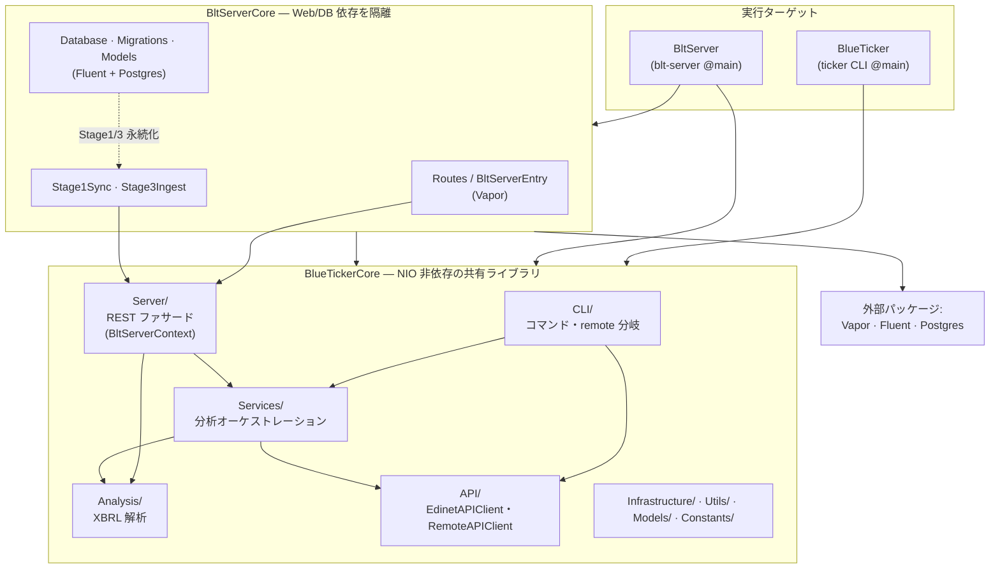
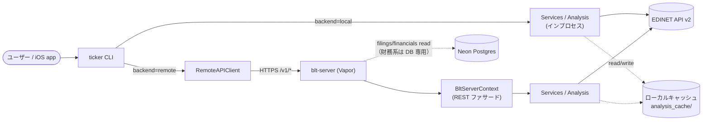
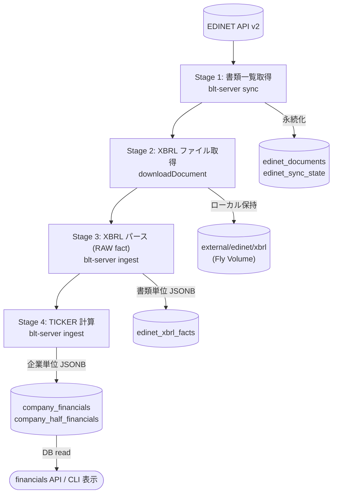

# システムアーキテクチャ

BLUE TICKER の全体構成。現在地のスナップショットであり、計画・履歴はロードマップ（`blt-server-roadmap.md`）と Git に置く。

## デプロイモード

CLI は同一バイナリのまま、設定（`edinet-backend`）で接続先を切り替える。

| モード | EDINET を叩くのは | blt-server | 状態 |
|---|---|---|---|
| **local** | CLI 自身 | なし | 互換のため残存。Stage 4 が read 床以上で servable 一巡後にユーザー向け廃止 |
| **remote (self-host)** | blt-server | 同一マシン | 基盤実装済み |
| **remote (cloud)** | blt-server | Fly.io (nrt) + Neon | **本番**（バックフィル進行中） |

> **方針（2026-06-28 確定・2026-07-09 更新）**: ユーザー向けは remote（cloud）へ集約する。**local モードのユーザー向け分析 CLI は、Stage 4 が read 床（いま `fin-v2`+）以上でユニバース servable になったら廃止**する（Dev CLI・Core・Unit Test は残す）。床は明示定数 `companyFinancialsMinServableVersion`（機械オフセットではない）。完了定義は `blt-server-roadmap.md`「ローカル CLI 廃止ゲート」。到達点は「Blue Ticker はサーバーで動き、CLI / GUI / MCP はそれを操作するクライアント」。
>
> **既定値**: `backend`（既定 remote）・`server-url`（既定 `Api.defaultRemoteServerURL`）。新規は `ticker login`（Cloudflare Access SSO、`deploy.md` 参照）だけで使い始められる。local / 別サーバーは `ticker config set --backend local` / `--server-url <url>` で上書き。

## ターゲット構成と依存方向

`ticker` CLI に Web/DB 依存（Vapor/Fluent/NIO）をリンクさせないため、トランスポート層を `BltServerCore` に隔離する。依存は一方向（`BltServerCore` → `BlueTickerCore`、逆流不可）。

依存ルール（同一モジュール内は import 方向をレビューで担保）:

- `Services/` は `CLI/` を参照しない
- `Analysis/` `API/` `Infrastructure/` `Utils/` は `CLI/` `Services/` `Server/` を参照しない
- `Server/` は REST ファサードのみ（Vapor/Fluent は `BltServerCore` 側）

## リクエストフロー（local / remote）

CLI 各コマンドは `run()` 冒頭で `RemoteBackend.clientIfEnabled()` を呼び、非 nil なら remote 経路、nil なら local 経路へ分岐する。**財務系（financials / half-financials）の計算は ingest（`blt-server ingest`）時に Core ロジックが実行して DB へ格納し、serving は格納済み結果を読むだけ（read-only。未格納は 404・ライブ計算へフォールバックしない）**。local 経路は従来どおり同じ Core ロジックを in-process 実行する。

接続情報の解決順位: env（`BLT_SERVER_URL`）> config。`/v1` の認証モードは起動時に env で決まる: `CF_ACCESS_TEAM_DOMAIN` 設定なら Cloudflare Access（エッジ信頼。origin 非検証） > 未設定なら無認証（dev）。CLI/iOS とも Cloudflare Access + IdP（SSO）で認証する（Bearer トークンによる self-host 認証は廃止済み）。詳細は `blt-server-roadmap.md`「認証」。

### REST エンドポイント（`/v1/`、公開契約）

| メソッド・パス | ファサード | 用途 |
|---|---|---|
| `GET /healthz` | — | ヘルスチェック（認証不要） |
| `GET /v1/companies?q=` | `searchCompanies` | 企業検索 |
| `GET /v1/sectors/{sector}/companies` | `searchBySector` | セクター別企業 |
| `GET /v1/companies/{code}/filings` | `getFilingsFromRecords`（DB read。未同期銘柄は `getFilings` ライブ探索） | 提出書類一覧 |
| `GET /v1/companies/{code}/financials` | DB read（`company_financials`。床未満・未格納 404・DB 非接続 503） | 計算済み財務指標（Stage 4）。read 床は `companyFinancialsMinServableVersion` |
| `GET /v1/companies/{code}/half-financials` | DB read（`company_half_financials`。years は `Api.halfMaxYears` へクランプ） | 半期財務指標（Stage 4-half） |
| `GET /v1/companies/{code}/filing-content` | `getFilingContent` | 有報セクション本文・セグメント |

レスポンス契約は単一の Codable 型から導出（`Models/FinancialsContract.swift`）。エラー封筒は `{"error":..., "status":N}`。

### MCP エンドポイント（ルートパス `POST /`）

`blt-server`（Vapor）に MCP プロトコル（[modelcontextprotocol/swift-sdk](https://github.com/modelcontextprotocol/swift-sdk)、`StatelessHTTPServerTransport`）をルートパス（`POST /`）として埋め込んでいる。`/v1` と同じ認証グループ配下（`CF_ACCESS_TEAM_DOMAIN` の env 駆動モードをそのまま共有）。

Vapor のルーティングはホスト名では分岐しないため、`api.<domain>` と `mcp.<domain>`（後述）は同一のルートテーブルを共有する。`mcp.<domain>` は MCP 専用サブドメインのため、パスなしでそのまま接続できるようルートパスに統一した（旧 `/mcp` パスは廃止）。

| ターゲット | 役割 |
|---|---|
| `Sources/BltMcpServerCore/` | MCP プロトコル層。ツールカタログ（`Tools.swift`）と `MCP.Server` ファクトリ（`ServerFactory.swift`）のみ。Vapor/Fluent 非依存 |
| `Sources/BltServerCore/MCPRoute.swift` | ルートパスへの MCP ルート登録・Vapor ↔ SDK アダプタ・ツールディスパッチ（`Routes.swift` の DB 読み取り共通関数 `serveStoredFinancials` 等を REST と共有し、ロジックを重複させない） |

ツールは REST エンドポイントと 1:1 対応する（`search_companies` / `search_by_sector` / `get_filings` / `get_financial_summary` / `get_half_financial_summary` / `get_filing_content`）。財務系ツールは REST 同様ライブ計算へフォールバックしない。

Phase 1 は既存 `api.<domain>` の配下（`/v1` と同一の SSO ポリシー）で疎通する。Claude.ai / ChatGPT 等 OAuth 2.1 前提のリモートクライアント向けには、**Phase 2**（2026-07-12 完了）として新規サブドメイン `mcp.<domain>` を Cloudflare Tunnel に追加し、パスなしの専用 Access アプリケーションに **Managed OAuth for Access** を有効化した（Managed OAuth はパス指定のあるドメインには設定できないため、`api.<domain>/mcp` のようなパス限定アプリでは有効化できず、専用サブドメインが必須だった）。discovery・`/authorize`・`/token`・DCR は Cloudflare エッジ側で完結し、origin（Vapor）側のコード変更は不要 — OAuth 完了後に origin が受け取るリクエストは Phase 1 と同じエッジ信頼のまま。Claude Desktop での接続・ツール呼び出しまで実機確認済み。ダッシュボード手順は `deploy.md`「MCP（Managed OAuth）」を参照。

## データパイプライン（Stage 1〜4）

EDINET → 計算済み JSON までの 4 段。Stage 4 はサーバー計算に集約し、クライアントは表示に専念する。

| Stage | 保存先 | 状態 |
|---|---|---|
| 1 書類一覧 | DB（`edinet_documents` / `edinet_sync_state`） | スキーマ・`sync` 実装済み。filings read も DB 優先 |
| 2 XBRL ファイル | ローカル保持（Stage 4 が生 HTML を要するため即削除不可） | `ingest` から取得・保持 |
| 3 XBRL パース | DB（`edinet_xbrl_facts`・書類単位 JSONB） | スキーマ・`ingest` 実装済み（RAW アーカイブ。Stage 4 は消費せず生 XBRL を読む） |
| 4 TICKER 計算 | DB（`company_financials`・企業単位 JSONB） | `ingest` で計算・格納。read は床以上（いま `fin-v2`+）を DB 専用返却（未格納・床未満 404・ライブ計算フォールバックなし） |
| 4-half 半期計算 | DB（`company_half_financials`・企業単位 JSONB） | 通期と同型（`ingest` 格納・DB 専用 read・years クランプ） |

Stage 3 RAW はサーバー内部の中間生成物で非公開。公開するのは Stage 4 の計算済み財務サマリのみ。

## キャッシュとデプロイ

ローカルキャッシュは取得物（`external/`）と生成物（`derived/`）に分離（詳細は `caching.md`）。

- compute / TLS / secrets / scheduler: **Fly.io**（self-host も同一 Docker イメージ）
- DB: **Neon**（serverless Postgres、`DATABASE_URL` 未設定ならステートレス EDINET プロキシとして起動）
- オブジェクトストレージ: **Cloudflare R2**（Stage 2 退避先、容量問題化まで延期）

詳細・残タスクは `blt-server-roadmap.md`、XBRL 解析仕様は `xbrl-parsing.md`、デプロイ手順は `deploy.md`、外部サービスの結合点・代替可能性・保守ポイントは `operations.md` を参照。

## コンテナ責務マップ

「Docker」は単一ツールだが、実際には複数の責務を兼任している。どの責務に依存しているかを legible にするための棚卸し。**現状はすべて Docker 1 つに集約**しており、責務ごとに実装を差し替える選択機構は持たない（後述）。

| 責務 | 役割 | 現状の実装 |
|---|---|---|
| Linux ランタイム（開発） | Linux でビルド・テスト検証 | Docker（`swift:6.1`） |
| DB ランタイム（テスト） | 統合テスト用 Postgres 起動 | Docker（`postgres:16-alpine`） |
| OCI イメージビルド | 配布用 `blt-server` イメージ生成 | Docker BuildKit（`Dockerfile` 2 段ビルド） |
| OCI Registry | イメージの push/pull | Docker はクライアント。Registry 実体は Fly/GHCR/Hub |
| 本番ランタイム | サーバーでコンテナ実行 | Fly.io 側（Firecracker 系）。ローカルツール非依存 |
| CI | Linux で自動検証 | GitHub Actions の Linux runner ＋ Docker |

> 代替候補（必要になったら差し替える脚注。今は採らない）: Linux ランタイム／DB ランタイム／OCI ビルドはいずれも OCI 準拠なら代替可。Docker Desktop が重い・ライセンスが障害なら **Colima**（`docker` CLI・`-p`・compose をそのまま使え 3 役を手順変更なしでカバー）か、Apple Silicon 限定なら **apple/container** を使える。DB ランタイムはネイティブ Postgres も可。CI／Registry／本番は apple/container の射程外。

**選択機構を常設しない理由**: 置換対象はコードではなく shell コマンドと CI yaml のみで、「ランタイムを選ぶコード」は存在しない。2 つ目の実装を常用してもいない段階で pluggable 化するのは予測的抽象化（`workflow.md`・global 哲学「抽象化は重複が発生してから」）。実際に Docker の痛みが顕在化したら、その責務 1 つだけ実装を差し替えてこの表を更新する。抽象化は「2 つ目が常用になった」時点で初めて入れる。
