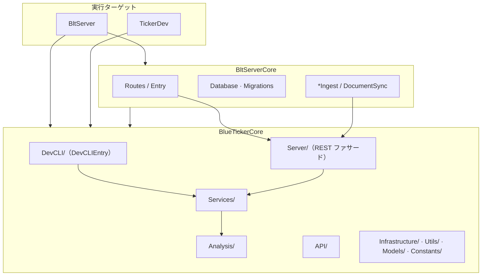
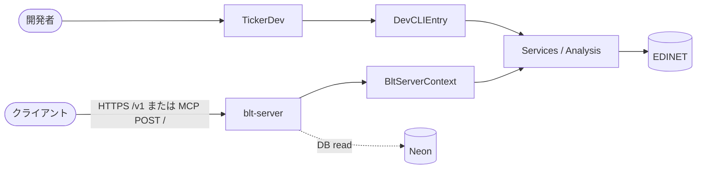

# システムアーキテクチャ

**現構成の正本**（箱・依存・エンドポイント）。進捗は `blt-server-roadmap.md`、cache 床は `.agents/rules/project/versioning.md`、経緯は Git。

## デプロイモード

配布 CLI `ticker` は廃止。ユーザー接点は REST / MCP。EDINET 直叩きは配布しない `TickerDev`（`swift run TickerDev`。products 非搭載）。

| モード | EDINET | blt-server | 状態 |
|---|---|---|---|
| `TickerDev` | 自身 | なし | 開発・フィクスチャ専用 |
| remote (self-host) | blt-server | 同一マシン | 基盤あり |
| remote (cloud) | blt-server | Fly (nrt) + Neon | **本番** |

**REST `/v1` が契約の正**。MCP は追従面。機械到達は Access Service Token（`api-auth.md`）。

## ターゲット構成と依存方向

Core に Vapor/Fluent をリンクさせない。依存は `BltServerCore` → `BlueTickerCore` のみ。

products は `blt-server` のみ。同一モジュール内の依存はレビューで担保（`AGENTS.md` と同趣旨）:

- `Services/` → `DevCLI/` 禁止
- `Analysis/` `API/` `Utils/` → `Services/` `Server/` `DevCLI/` 禁止
- `Server/` はファサードのみ。`DevCLI/` の public 面は `DevCLIEntry` のみ

## リクエストフロー

財務系の計算は ingest 時。serving は DB read のみ（未格納 404。ライブ計算フォールバックなし）。

認証: `CF_ACCESS_TEAM_DOMAIN` あり → Access（エッジ信頼） / なし → 無認証（dev）。詳細は `deploy.md` / `api-auth.md`。

### REST（`/v1/`）

| パス | 用途 |
|---|---|
| `GET /healthz` | ヘルス（認証不要）・`cache_versions` |
| `GET /v1/skills` · `/v1/skills/{id}` | 能力カタログ |
| `GET /v1/companies?q=` | 企業検索 |
| `GET /v1/companies/{code}/filings` | 提出書類一覧 |
| `GET /v1/companies/{code}/financials` | Summary（床未満・未格納 404） |
| `GET /v1/companies/{code}/waterfall` | Waterfall |
| `GET /v1/companies/{code}/filing-content` | セクション本文 |
| `GET /v1/companies/{code}/breakdown?axis=` | breakdowns（日経225） |
| `GET /v1/companies/{code}/statement` · `/statement/notes` | Statement / Notes（日経225） |

エラー封筒: `{"error":...,"status":N}`。

### MCP（`POST /`）

`BltMcpServerCore`（プロトコル）＋ `MCPRoute.swift`（Vapor 配線）。ツールは REST と共有 serve。カタログ正本は `ApiSkills.swift`。Managed OAuth は `mcp.*` 専用（パス付きホストでは不可）。ChatGPT 非標準プレハンドシェイク等の吸収は `MCPRoute.swift` コメントが正本。

## データパイプライン（構成）

取り込み対象と保存先の**構成**のみ。進捗・停止理由は `blt-server-roadmap.md`。床定数は `versioning.md`。

| 対象 | 保存先 |
|---|---|
| sync | `edinet_documents` / `edinet_sync_state` |
| 生 XBRL | Volume / ローカル |
| facts | `edinet_xbrl_facts`（非公開 RAW） |
| financials | `company_financials` |
| filing-sections / breakdowns / statements / notes | 各テーブル |

## キャッシュとデプロイ

ローカルキャッシュは `external/` と `derived/`（`caching.md`）。本番: Fly compute + Neon DB。R2 退避は延期。

## コンテナ責務

Linux 検証・テスト Postgres・OCI ビルドは Docker。本番実行は Fly。選択機構の常設はしない（2つ目の実装が常用になってから）。

詳細: `deploy.md` · `operations.md` · `xbrl-parsing.md` · `blt-server-roadmap.md`
