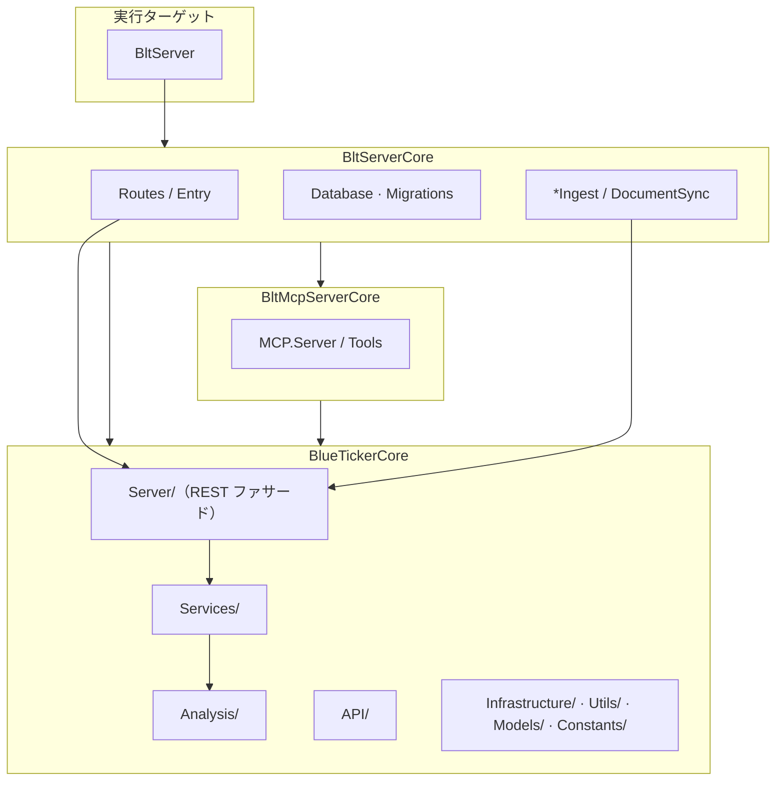
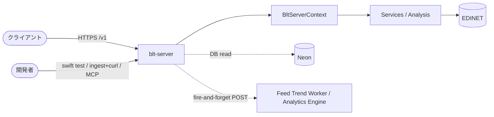

# システムアーキテクチャ

**現構成の正本**（箱・依存・エンドポイント）。方針は `blt-server-roadmap.md`、進捗は Linear（[JP 現在地](https://linear.app/sollahiro/document/jp-現在地-af2abd076034) / [公開と基盤 現在地](https://linear.app/sollahiro/document/公開と基盤-現在地-3bd56370454b)）、cache 床は各 Contract 定数（バンプ規則は `.agents/rules/versioning.md`）、経緯は Git。

## 提供面

| 面 | 位置づけ |
|---|---|
| REST `/v1` | **製品の契約の正**。段階 A は Access Service Token。段階 B は `public-api.md` |
| iOS | 近傍の製品面（`Apps/BlueTicker`。REST `/v1` の HTTP クライアント。IA は `ios-client.md`、進捗は Linear Team `blue-ticker`） |
| MCP（`POST /`） | **開発時のみ**（Cursor / 手元）。`BltMcpServerCore` は残す。製品として伸ばさない。ChatGPT Apps は凍結 |
| Web / RSS | 将来候補（優先度低） |

機能単位の有料マスクは採らない。公開ゲート（どの Feature をいつ外に出すか）は Linear。実装サイクルは `.agents/skills/xbrl-development/SKILL.md`。

## Class 依存

実装・理解の順（下は上に依存）。JP / EU とも同じ。

```text
Meta → Struct → Norm → Viz
```

| Class | 役割 | 主な Feature |
|---|---|---|
| Meta | 発行体・書類の同定 | Search, Icon |
| Struct | 開示の構造化（**正本**） | Filing, Statement, Statement-Notes |
| Norm | 正規化・組立 | Breakdown（内訳正本）, Summary（組立スナップショット） |
| Viz | 正規化値の分解・配分 | Waterfall, Sankey |
| Feed | 縦依存の外 | Trend, Update, Status, Report |

**Summary** は Statement / Statement-Notes / Breakdown 経路の組立（Filing は本文。`financials-summary-separation.md`）。

## Region × Source（モノレポ命名）

単一リポジトリで複数市場を扱う。命名の対応は固定:

| 軸 | 対 |
|---|---|
| **Region** | `JP` ↔ `EU` |
| **Source** | `EDINET` ↔ `ESEF` |

| | JP / EDINET | EU / ESEF |
|---|---|---|
| 実装の正 | `Sources/BlueTicker/`（現行） | 探索: `scripts/eu/esef/`（Core 追加時は Region/Source がパスから分かる場所） |
| 探索スクリプト | `scripts/jp/edinet/`（ポインタ） | `scripts/eu/esef/` |
| cache | `tmp_cache/edinet/` | `tmp_cache/eu/esef/` |

規律の短文正本: `.agents/rules/regions.md`。共有するのは FieldSet / resolve / 配信契約など Source 非依存層。コンテキスト名・タグ定数・パッケージ取得は Source 配下に閉じる。EU の方針は `eu-esef-roadmap.md`、進捗・未決は Linear（[EU 現在地](https://linear.app/sollahiro/document/eu-現在地-844f7112eb70)）。

## デプロイモード

配布 CLI `ticker` / 開発 CLI `TickerDev` は廃止。製品接点は REST。検証は `swift test`（smoke/golden）と、使い捨て Neon へ ingest したうえでの `/v1`。MCP は開発検証用。

| モード | EDINET | blt-server | 状態 |
|---|---|---|---|
| local verify | キャッシュ or 取得 | 任意（契約確認時は disposable DB） | 開発 |
| remote (self-host) | blt-server | 同一マシン | 基盤あり |
| remote (cloud) | blt-server | Fly (nrt) + Neon | **本番** |

機械到達は Access Service Token（`api-auth.md`）。

公開デプロイの安全性は **Tunnel ＋ 公開ポート閉鎖（serviceless）＋ Access** の 3 点。どれか欠けると無認証素通り。Fly の `[http_service]` を戻さない。手順は `.agents/skills/deploy/SKILL.md`。

## ターゲット構成と依存方向

Core に Vapor/Fluent をリンクさせない。実行バイナリは薄く、Web/DB は `BltServerCore` に閉じる。

外部パッケージの一覧・用途・リンク先は **`Package.swift` 先頭コメントが正本**（`.agents/rules/architecture.md`）。



products は `blt-server` のみ。同一モジュール内の依存はレビューで担保（`AGENTS.md` と同趣旨）:

- `Services/` → `Server/` 禁止
- `Analysis/` `API/` `Utils/` → `Services/` `Server/` 禁止
- `Server/` はファサードのみ

## リクエストフロー

財務系の計算は ingest 時。serving は DB read のみ（未格納 404。ライブ計算フォールバックなし）。



認証: `CF_ACCESS_TEAM_DOMAIN` あり → Access（エッジ信頼） / なし → 無認証（dev）。詳細は `api-auth.md` / `.agents/skills/deploy/SKILL.md`。

### REST（`/v1/`）

| パス | 用途 |
|---|---|
| `GET /healthz` | ヘルス（認証不要）・`cache_versions` |
| `GET /v1/skills` · `/v1/skills/{id}` | 能力カタログ |
| `GET /v1/companies?q=` | 企業検索（JP / EDINET） |
| `GET /v1/eu/companies?q=` | EU/ESEF Meta Search（**preview**。skills 未掲載） |
| `GET /v1/companies/{code}/filings` | 提出書類一覧 |
| `GET /v1/companies/{code}/overview` | 短い会社説明（格納済み。MCP には出さない） |
| `GET /v1/companies/{code}/financials` | Summary（床未満・未格納 404）。`?fields=` で `years[]` の公開キーを射影（不明キー 400） |
| `GET /v1/companies/{code}/waterfall` | Waterfall |
| `GET /v1/companies/{code}/filing-content` | セクション本文 |
| `GET /v1/companies/{code}/breakdown?axis=` | breakdowns（上場・格納済み） |
| `GET /v1/companies/{code}/statement` · `/statement/notes` | Statement（上場） / Notes（日経225） |
| `GET /v1/feed/updates` | Feed Update（直近 N 日の提出書類。既定 7 日。`total.day` / `total.week`） |
| `GET /v1/feed/trend` | Feed Trend（匿名の検索・ツールヒット件数。書類件数ではない。カウンター未設定は 503） |
| `GET /v1/screen` | Screen（`screen_index` 横断検索。skills / MCP 未掲載。索引未生成は 404。`sales_growth` は ingest 時の派生列） |

エラー封筒: `{"error":...,"status":N}`。

### MCP（開発用 `POST /`）

`BltMcpServerCore`（プロトコル）＋ `MCPRoute.swift`（Vapor 配線）。ツールは REST と共有 serve。カタログ正本は `ApiSkills.swift`。Managed OAuth は `mcp.*` 専用（パス付きホストでは不可）。製品面ではない。非標準プレハンドシェイク等の吸収は `MCPRoute.swift` コメントが正本。iOS は公開 REST のクライアント（Service Token を埋め込まない。開発は `127.0.0.1` 無認証）。`api-auth.md` のクライアント表はまだ変えない。

## 環境変数（薄い表）

Neon 接続・R2 秘密・LLM キーの正本は `.env.example`。プロセスが読む接続スロットは `DATABASE_URL` だけ。

| 変数 | 役割 |
|---|---|
| `BLT_HOST` / `BLT_PORT` | bind（既定 `0.0.0.0:8080`） |
| `BLUE_TICKER_ASSETS_PATH` | assets（既定 `/app/assets`） |
| `BLUE_TICKER_USER_DATA_PATH` | キャッシュ永続先（既定 `/data`） |
| `BLT_EDINET_API_KEY` | EDINET（**secret・必須**） |
| `CF_ACCESS_TEAM_DOMAIN` | 設定時 Access モード。公開デプロイでは**必須**（未設定＝無認証） |
| `CLOUDFLARE_TUNNEL_TOKEN` | 設定時のみ cloudflared 起動 |
| `DATABASE_URL` | プロセス束縛（未設定＝ステートレス）。手元は disposable、Fly ではその環境の Neon を直接指定 |
| `BLT_FEED_TREND_URL` / `BLT_FEED_TREND_TOKEN` | 匿名 Feed Trend カウンター（未設定＝emit なし。`GET /v1/feed/trend` は 503）。Worker は `api.*` の前段に置かない |

`/healthz` は認証不要。`cache_versions` でイメージの版を確認。Bearer は廃止済み。

## データパイプライン（構成）

取り込み対象と保存先の**構成**のみ。進捗は Linear。床定数は `.agents/rules/versioning.md`。

| 対象 | 保存先 |
|---|---|
| sync | `edinet_documents` / `edinet_sync_state` |
| 生 XBRL | ローカル展開（L1）＋ R2 ZIP（L2、`BLT_R2_XBRL_BUCKET` 未設定時はローカルのみ。キー `jp/edinet/xbrl/{docID}.zip`） |
| facts | 閉じた。スキーマ `edinet_xbrl_facts` は残るが取り込みしない |
| financials | `company_financials` |
| filing-sections / breakdowns / statements / notes | 各テーブル（書類単位） |
| overview | `company_overviews`（会社1社=1行。由来 doc_id は列。ingest stage は `overviews`。公開 REST は `GET /v1/companies/{code}/overview`。read 床は `overview-v1`。Filing `texts` には載せない） |

## キャッシュとデプロイ

ローカルキャッシュは `external/` と `derived/`（`.agents/rules/caching.md`）。本番: Fly compute + Neon DB。生 XBRL の中央コピーは R2（ingest 時 L2。配信は読まない）。書類単位 ingest（filing-sections / breakdowns / statements / notes）は各社の最新有報を先に回し、同一年次内では日経225のあと、ローカルに展開済みの XBRL を先に回す（未キャッシュは R2、それも無ければ EDINET ダウンロード）。同一展開 dir の数値 fact 再収集はプロセス内 FIFO（ラベルキャッシュと同容量）。icons / overviews は最新1件、financials は会社単位のためこの年次並びの対象外。

## コンテナ責務

Linux 検証・テスト Postgres・手元の OCI ビルドは Apple `container`。本番実行は Fly（Dockerfile をリモートビルド）。選択機構の常設はしない。

詳細: `.agents/skills/deploy/SKILL.md` · `xbrl-parsing.md` · `blt-server-roadmap.md` · `ios-client.md`
