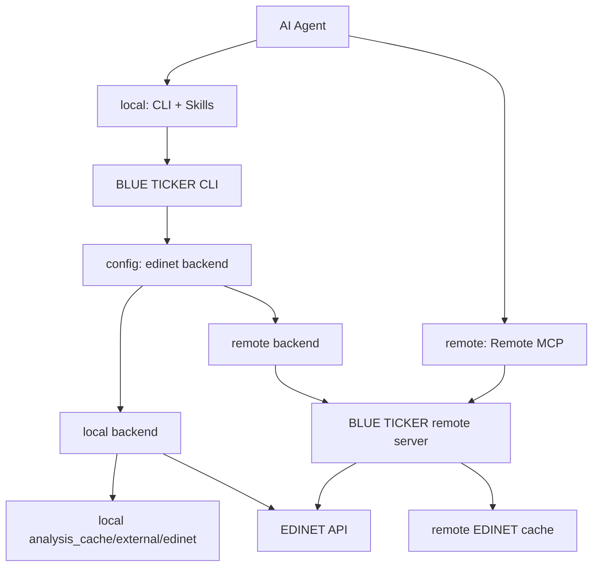

# MCP サーバーと backend 移行ロードマップ

作成日: 2026-05-06
最終更新: 2026-05-30

blue-ticker を 2 本立てで運用するアーキテクチャの設計・実装状況・TODO を記録する。

---

## ゴール

- ローカル MCP は段階的に廃止済み（Phase 5 完了）。
- ローカル CLI は継続し、AI エージェントは Skills 経由で CLI を操作できるようにする。
- EDINET API との直接通信は、将来的に外部サーバーへ移管できるようにする。
- CLI はローカル backend とリモート backend を設定で選べるようにする。
- 既存のローカルキャッシュ機能は正式な backend として残し、リモート backend と並行運用できるようにする。

## 非ゴール

- `ticker analyze` などの各サブコマンドに backend 選択オプションを増やさない。
- `CacheManager` と EDINET external cache を無理に単一抽象へ統合しない。
- リモート MCP 移行と同時に、既存の CLI 出力契約やキャッシュ形式を大きく変えない。
- ローカルキャッシュを「レガシー」として扱わない。

---

## 将来構成



## Backend 方針

backend は CLI の個別サブコマンドではなく、設定で選択する。

| backend | 用途 | 認証 | EDINET API 通信 | キャッシュ |
|---|---|---|---|---|
| `local` | 現行 CLI 互換。ローカル運用 | EDINET API キー（CLI マシン上の `settings_store`） | CLI プロセスが直接実行 | ローカル `analysis_cache/external/edinet` |
| `remote` | リモート MCP / 外部サーバー運用 | OAuth 等の remote server 認証 | remote server が実行 | サーバー上の remote cache |

初期値は `local`。`hybrid` はデータ鮮度や再現性が曖昧になりやすいため、最初の remote 実装では見送る。

設定イメージ:

```bash
# local backend（現行）
ticker config set edinet-backend local
ticker config set edinet-key <EDINET_API_KEY>

# remote backend（Phase 2 以降）
ticker config set edinet-backend remote
ticker config login
```

---

## アーキテクチャ決定事項

### 1. 通信モデル：共有データストア方式（現行）

```
[MCP サーバー]   書き込み →  analysis_cache/（ファイル）
[CLI]            読み込み ←  analysis_cache/（ファイル）
[チャットボット]  MCP ツール → [MCP サーバー] → analysis_cache/
```

**自己ホスト（現行）**: サーバーと CLI が同一マシン上にある場合、CLI は HTTP 通信せず、データストアをローカルファイルとして直接読む。`mcp` パッケージは CLI バイナリに含めない。

**将来（サーバー別マシン化後）**: CLI は `remote` backend 経由でサーバーへ HTTP 通信する（Phase 3 対応時）。CLI を `get_financial_summary` / `get_filings` の結果を受け取る薄いレンダラーへ移行するのはこの段階を指す。

### 2. API キー管理

| 利用形態 | API キーの所在 |
|---|---|
| CLI + `local` backend | CLI マシンの `settings_store`（`ticker config set edinet-key`） |
| CLI + `remote` backend | サーバー側の `settings_store`（CLI ユーザーは不要） |
| チャットボット + remote MCP | サーバー側の `settings_store`（チャットボットユーザーは不要） |

### 3. 依存パッケージ

`mcp` パッケージは `server` dependency group にのみ追加する。CLI のビルド・インストールには含まれない。

```toml
[dependency-groups]
server = [
    "mcp>=1.0.0,<2.0.0",
]
```

### 4. トランスポート

`streamable-http`（FastMCP デフォルト）で起動。初期は認証なし・自己ホスト・ローカルネットワーク前提。OAuth は将来対応。

### 5. 計算ロジックの置き場所

財務指標計算（YoY、ROE、ROIC、WACC など）は**サーバー側**で行い、MCP ツールが算出済みデータを返す。CLI は受け取ったデータを整形・表示するレンダラーとして特化する（自己ホスト現行では `data_service` を直接呼ぶが、将来的にレンダラーへ移行）。

---

## 実装状況

### Phase 1: EDINET キャッシュ境界（完了）

| ファイル | 役割 |
|---|---|
| `blue_ticker/api/edinet_cache_backend.py` | `EdinetCacheBackend`。EDINET external cache の差し替え境界 |
| `blue_ticker/api/edinet_cache_store.py` | `EdinetCacheBackend` のローカルファイル実装 |
| `blue_ticker/api/edinet_client.py` | 具象 `EdinetCacheStore` ではなく `EdinetCacheBackend` を受け取る |
| `tests/test_edinet_client.py` | メモリ backend を差し込み、抽象境界で動くことを確認 |

### Phase 4: MCP サーバー初期実装（進行中）

自己ホスト・認証なし・共有データストア方式で `mcp_server/` モジュールを新設した。

#### 実装済みファイル

```
blue_ticker/mcp_server/
  __init__.py
  server.py                   ← FastMCP エントリポイント。全ツール登録 + main()
  tools/
    __init__.py
    search.py                 ← search_companies, search_by_sector
    filings.py                ← get_filings
    financial.py              ← get_financial_summary（YearEntry のフラット化）
    filing_content.py         ← get_filing_content
  sync/
    __init__.py
    document_list.py          ← sync_document_list（Stage 1 バッチ）

pyproject.toml
  [dependency-groups].server  ← mcp>=1.0.0,<2.0.0（追加済み・poetry.lock 生成済み）
  [project.scripts].blt-server ← blue_ticker.mcp_server.server:main
```

起動コマンド: `blt-server`（streamable-http、デフォルトポート 8000）

#### データパイプライン（ステージ設計）

書類一覧から XBRL 解析まで 4 段階。各ステージは独立してスケジュール・拡張できる。

```
Stage 1  書類一覧同期   EDINET API → analysis_cache/external/edinet/documents_by_date/
                                      analysis_cache/external/edinet/document_indexes/
Stage 2  XBRL 取得      書類一覧 → analysis_cache/external/edinet/xbrl/{doc_id}/
Stage 3  XBRL 数値抽出  xbrl → analysis_cache/derived/xbrl_numeric_index/{doc_id}.json
Stage 4  財務指標計算   xbrl_numeric_index → analysis_cache/derived/analysis/{code}.json
```

各ステージに `status.json` を持たせ「どこまで処理したか」を管理する。後ろのステージは前のステージの出力を読むだけで疎結合を維持する。

| ステージ | 状況 | 備考 |
|---|---|---|
| Stage 1 | **実装済み** | `sync/document_list.py`。既存 `cache catchup` と同等ロジック |
| Stage 2 | 未実装 | 将来拡張 |
| Stage 3 | 未実装 | 将来拡張 |
| Stage 4 | 未実装（オンデマンド動作） | `get_financial_summary` 呼び出し時にオンデマンドで実行・キャッシュ |

#### MCP ツール一覧

| ツール | データ源 | 状況 |
|---|---|---|
| `search_companies(query)` | マスターデータ | 実装済み |
| `search_by_sector(sector, limit)` | マスターデータ | 実装済み |
| `get_filings(code, max_years)` | Stage 1（書類一覧） | 実装済み |
| `get_financial_summary(code, years)` | Stage 4（オンデマンド） | 実装済み |
| `get_filing_content(code, doc_id, sections)` | オンデマンド | 実装済み |
| `sync_document_list(years)` | — | 実装済み（管理用） |

##### `get_filings` レスポンス例

```json
{
  "code": "9984",
  "name": "ソフトバンクグループ株式会社",
  "filings": [
    {
      "doc_id": "S100VXJA",
      "doc_type": "120",
      "doc_type_label": "有価証券報告書",
      "fy_end": "2025-03",
      "submitted_at": "2025-06-20"
    }
  ]
}
```

##### `get_financial_summary` レスポンス例

金額は百万円（JPY）、比率は %、株主指標は円。

```json
{
  "code": "9984",
  "name": "ソフトバンクグループ株式会社",
  "sector": "情報・通信業",
  "market": "プライム",
  "currency": "JPY",
  "unit": "百万円",
  "years": [
    {
      "fy_end": "2025-03",
      "financial_period": "FY",
      "doc_id": "S100VXJA",
      "sales": 18500000,
      "gross_profit": 3200000,
      "gross_profit_margin": 17.3,
      "operating_profit": 450000,
      "operating_margin": 2.4,
      "net_profit": 950000,
      "cfo": 1200000,
      "cfi": -800000,
      "cfc": 400000,
      "eps": 456.7,
      "bps": 3210.5,
      "dividends_per_share": 150.0,
      "payout_ratio": 32.1,
      "total_assets": 45000000,
      "net_assets": 12000000,
      "interest_bearing_debt": 18000000,
      "roe": 12.3,
      "roic": 5.1,
      "wacc": 6.2,
      "employees": 80000
    }
  ]
}
```

---

## フェーズ計画

### Phase 1: 抽象化の定着（完了）

目的: ローカル実装を壊さず、リモート実装を差し込める境界を安定させる。

- `EdinetCacheBackend` を EDINET external cache の正式境界として扱う。
- `EdinetCacheStore` はローカル backend 実装として残す。
- `EdinetAPIClient` からローカルファイル I/O 前提を増やさない。
- 新しい EDINET external cache 操作は、まず `EdinetCacheBackend` に必要性を確認してから追加する。
- `tests/test_edinet_client.py` でローカル以外の backend 差し込みを継続的に検証する。

### Phase 2: config 設計（未着手）

目的: backend 選択と認証設定を CLI 設定に導入する。

- `SettingsStore` に `edinetBackend` を追加する。初期値は `local`。
- 許可値はまず `local` / `remote` の 2 択にする。
- `local` では EDINET API キーを使う。
- `remote` では EDINET API キーではなく、remote server 認証を使う。
- `config show` では backend と認証状態を明示する。
- `config init` は backend 選択に応じて、EDINET API キー設定または remote login 導線を出す。

注意点:
- backend 選択用のサブコマンドは追加しない。
- `analyze` / `filings` / `filing` / `cache` など各サブコマンドに `--edinet-backend` は追加しない。
- OAuth の具体実装前は、remote backend を選べても「未対応」と分かる戻り値にするか、設定保存のみ先行する。

### Phase 3: remote backend 最小実装（未着手）

目的: CLI が EDINET API へ直接アクセスせず、remote server から同等のデータを取得できるようにする。

- `RemoteEdinetCacheBackend` を追加する。
- remote server との通信は標準ライブラリまたは既存依存で実装する。新規依存が必要な場合は事前確認する。
- remote backend は以下の操作を提供する。
  - 日別書類一覧の取得
  - 年次書類インデックスの取得
  - XBRL package の取得
  - XBRL をローカル解析用ディレクトリへ materialize する処理
- XBRL 解析コードは当面 `Path` ベースを維持する。remote から取得した XBRL も、CLI 側の一時または artifact cache に展開して既存解析器へ渡す。

注意点:
- remote backend では CLI から EDINET API キーを使わない。
- remote cache の TTL や更新方針はサーバー側で管理する。
- CLI 側には remote から取得した XBRL artifact の短期キャッシュだけを置く設計を優先する。

**自己ホスト版の例外**: サーバーと CLI が同一マシン上にある場合は `RemoteEdinetCacheBackend` を経由せず、サーバーが書いたデータストアをローカルファイルとして直接読む（現行の共有データストア方式）。Phase 3 の HTTP 通信実装はサーバーを別マシンへ移す時点で対応する。

### Phase 4: remote MCP 導入（進行中）

目的: MCP 利用時の EDINET 処理を remote server 側へ寄せる。

- remote MCP は remote server 上のキャッシュと EDINET 取得機能を使う。
- remote MCP の公開機能とパラメーターは、CLI の公開機能を基準に設計する。
- remote MCP は、ローカルの `analysis_cache` を直接操作しない。
- キャッシュ削除系は引き続き慎重に扱う。remote MCP から破壊的な削除操作を出す場合は、別途安全設計を行う。

**実装済み（2026-05-30）**:

- `blue_ticker/mcp_server/` に FastMCP サーバーを新設。`blt-server` コマンドで起動。
- MCP ツール 5 本（`search_companies`、`search_by_sector`、`get_filings`、`get_financial_summary`、`get_filing_content`）。
- 書類一覧の定期同期バッチ（`sync_document_list`）。
- 財務指標計算はサーバー側（`data_service` + `analyzer.py` 経由）で実行し、算出済みデータを返す。
- `[dependency-groups].server` に `mcp>=1.0.0,<2.0.0` 追加済み。`poetry.lock` 生成済み。
- `tests/test_dependency_rules.py` に `mcp_server` レイヤーのルール追加済み。

完了条件:
- remote MCP で主要機能が動作する。
- ローカル MCP なしでも、AI エージェントのローカル操作は CLI + Skills で成立する。

### Phase 5: ローカル MCP 廃止（完了）

目的: MCP の運用経路を remote へ寄せ、ローカル MCP の保守負荷を下げる。

削除済み:
- `ticker mcp start`
- `ticker mcp install-*`
- ローカル MCP サーバー固有の設定・テスト

残すもの:
- BLUE TICKER CLI 本体
- ローカル `EdinetCacheStore`
- `analysis_cache/derived` と `analysis_cache/external/edinet` のローカル運用
- Skills から CLI を操作する運用

---

## TODO

### 必須（使い始める前に）

- [ ] サーバーマシンの `settings_store` に EDINET API キーを設定する（`ticker config set edinet-key`）
- [ ] `blt-server` で起動確認し、`sync_document_list` ツールで書類一覧を初回同期する

### 近期（Stage 1 安定化）

- [ ] `sync_document_list` の定期実行を cron または launchd で設定する（例: 毎朝 7:00）

### 中期（CLI のサーバー化対応）

- [ ] Phase 2: `ticker config set edinet-backend remote` のサポートを実装する
- [ ] `services/data_service.py` の「取得部分」と「計算部分」を分割する（Phase 3 の前提）
  - 取得部分（EDINET 通信・XBRL 展開）: サーバー側で完結
  - 計算部分（YoY 差分・比率計算）: `get_financial_summary` ツールが担う
- [ ] CLI を `get_financial_summary` / `get_filings` の結果を受け取る薄いレンダラーへ移行する（Phase 3 対応時）
  - `analyze` コマンド: `get_financial_summary` → 整形出力
  - `filings` コマンド: `get_filings` → 整形出力

### 将来（パイプライン拡張）

- [ ] Stage 2: XBRL ダウンロードの事前取得バッチ（対象銘柄リストを設定で管理）
- [ ] Stage 3: XBRL 数値抽出の事前取得バッチ
- [ ] Stage 4: 財務指標計算の事前取得バッチ（`get_financial_summary` をオンデマンドから事前計算へ）
- [ ] 各ステージの `status.json` 管理（処理済みリストと更新日時）
- [ ] OAuth 認証の追加（複数ユーザー・外部公開が必要になった場合）

---

## 設計上の判断

### ローカルキャッシュは正式 backend として残す

ローカルキャッシュは、リモート移行後も CLI 利用時の正式 backend とする。EDINET API キーをローカルに置き、CLI が直接 EDINET API へアクセスする使い方は残す。

### EDINET external cache と derived cache は分ける

EDINET external cache は外部取得物、derived cache は BLUE TICKER 生成物であり、TTL、バージョン、削除ポリシーが異なる。したがって、現時点では `EdinetCacheBackend` と `CacheManager` を統合しない。

### XBRL はローカル Path へ materialize する

既存の XBRL 解析器はローカルディレクトリを読む。remote backend でも最終的にはローカル Path を返せるようにし、解析器側を remote aware にしない。

### backend 選択は config で行う

サブコマンドごとに backend option を足すと CLI の表面積が増える。通常利用では backend は環境・認証に紐づくため、`config` に集約する。

### 自己ホスト版では共有データストア方式を採用する

サーバーと CLI が同一マシン上にある場合、CLI は MCP サーバーへ HTTP 通信せず、サーバーが書いたデータストア（`analysis_cache/` と同じ構造）をローカルファイルとして直接読む。`mcp` パッケージは CLI バイナリに含めない。サーバーを別マシンへ移す段階で Phase 3 の HTTP 通信実装を追加する。

### 計算ロジックはサーバー側で実行する

財務指標計算（YoY 差分・ROE・ROIC・WACC 等）は MCP サーバーが担い、CLI はその結果を整形・表示するレンダラーとして特化する。これにより CLI とチャットボットが同じ計算結果を参照でき、数値の一貫性が保たれる。

---

## 未決事項

- OAuth フローとトークン保存場所
- remote cache 削除ポリシー
- remote backend 利用時の `ticker cache status` 表示内容
- remote XBRL artifact をローカルにどれくらい保持するか（サーバー別マシン化時）
- local / remote 間で分析結果キャッシュ `derived/` を共有するか、backend ごとに分けるか

---

## 関連ドキュメント

- `docs/architecture-status.md` — コードベース現状評価
- `docs/architecture-review.md`
- `.agents/rules/project/caching.md` — キャッシュ設計規約
- `.agents/rules/project/dependencies.md` — アーキテクチャ依存ルール（mcp_server レイヤーを含む）
