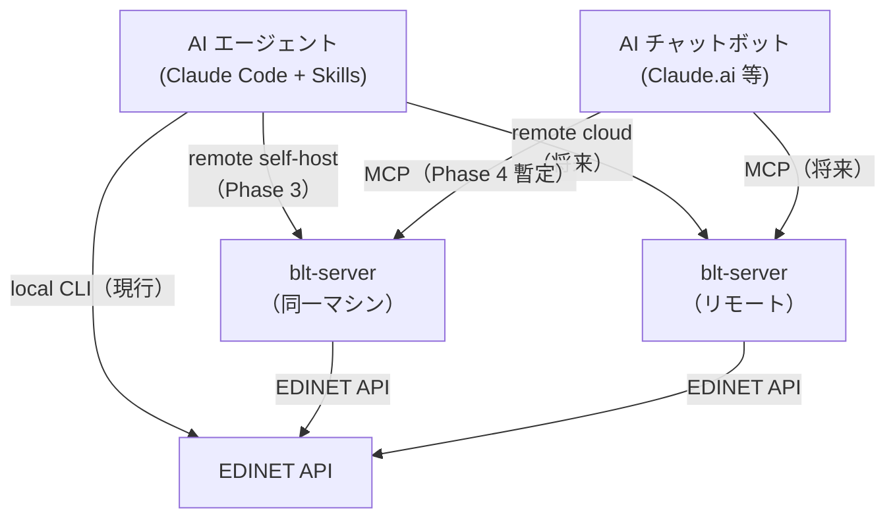

# MCP サーバーと backend 移行ロードマップ

作成日: 2026-05-06
最終更新: 2026-06-03

blue-ticker は **3 つのデプロイモード**を持つ。EDINET データを誰が取得するかが主な違い。

| モード | blt-server | EDINET を叩くのは | クライアント | 状態 |
|---|---|---|---|---|
| **local CLI** | なし | CLI | CLI | 現行 |
| **remote (self-host)** | 同一マシン | blt-server | CLI | Phase 2/3 以降 |
| **remote (cloud)** | リモートサーバー | blt-server | CLI・MCP | 将来検討 |

**Phase 4（完了）**: `blt-server` の実装・起動確認済み。MCP の本番形態は remote (cloud) を想定。

**Claude.ai カスタムコネクタからの接続について**: Claude.ai はクラウドサービスのため、`127.0.0.1`（localhost）には到達できない。Claude.ai から接続するには外部公開が必要（後述の「外部公開」セクションを参照）。Claude Code（ローカル CLI）からは `127.0.0.1:8000` で接続可能。

---

## 構成図



---

## ゴール

- local CLI は blt-server 不要の独立モードとして維持する。
- remote (cloud) により AI チャットボットおよび CLI が共通の blt-server を通じて財務データにアクセスできるようにする。
- remote CLI への移行は「API キーをサーバーだけに集中させたい」要件が強くなった時点で検討する。

## 非ゴール

- `ticker analyze` などの各サブコマンドに backend 選択オプションを増やさない。
- `CacheManager` と EDINET external cache を無理に単一抽象へ統合しない。
- リモート MCP 移行と同時に、既存の CLI 出力契約やキャッシュ形式を大きく変えない。
- ローカルキャッシュを「レガシー」として扱わない。

---

## CLI backend 設定（remote CLI 実装後）

backend は CLI の個別サブコマンドではなく、設定で選択する。

```bash
# local CLI（現行・デフォルト）
ticker config set edinet-backend local
ticker config set edinet-key <EDINET_API_KEY>

# remote CLI（Phase 2 以降）
ticker config set edinet-backend remote
ticker config login
```

---

## アーキテクチャ決定事項

### 1. 通信モデル

**local CLI（現行）**: CLI プロセスが EDINET API に直接アクセスし、`analysis_cache/` に読み書きする。blt-server 不要。

**remote (self-host)（Phase 2/3）**: blt-server が同一マシンで動き、EDINET API を叩いて `analysis_cache/` に書く。CLI はそのファイルをローカルパスで直接読む（HTTP 不要）。local CLI と同一マシンで並走する場合は同じ `analysis_cache/` を共有する（両者は同じロジックで同じ結果を書くため内容差分は出にくいが、同時書き込み時の atomicity は保証されない点は留意）。

**remote (cloud)（将来）**: blt-server がリモートサーバーで動く。CLI は HTTP 経由でアクセスし、MCP クライアント（Claude.ai 等）も同じ blt-server に接続する。`analysis_cache/` はサーバー側で独立管理。

CLI を `get_financial_summary` / `get_filings` の結果を受け取る薄いレンダラーへ移行するのは remote モード導入時。

### 2. API キー管理

| 利用形態 | API キーの所在 |
|---|---|
| local CLI | CLI マシンの `settings_store`（`ticker config set edinet-key`） |
| remote CLI | サーバー側の `settings_store`（CLI ユーザーは不要） |
| remote MCP | サーバー側の `settings_store`（チャットボットユーザーは不要） |

### 3. 依存パッケージ

`mcp` パッケージは `server` dependency group にのみ追加する。CLI のビルド・インストールには含まれない。

```toml
[dependency-groups]
server = [
    "mcp>=1.0.0,<2.0.0",
]
```

### 4. トランスポート

`streamable-http`（FastMCP デフォルト）で起動。初期は認証なし・自己ホスト・ローカルネットワーク前提。OAuth は将来対応。

### 5. 計算ロジックの置き場所

**local CLI**: CLI が `data_service` → `analyzer.py` 経由で自前計算する。

**remote CLI / remote MCP**: blt-server が計算し、算出済みデータを返す。remote CLI では CLI はその結果を整形・表示するレンダラーとして特化する。

**採用理由（remote CLI / remote MCP）**: CLI とチャットボットが同じ計算結果を参照でき、数値の一貫性が保たれる。

---

## 実装状況

### Phase 1: EDINET キャッシュ境界（完了）

| ファイル | 役割 |
|---|---|
| `blue_ticker/api/edinet_cache_backend.py` | `EdinetCacheBackend`。EDINET external cache の差し替え境界 |
| `blue_ticker/api/edinet_cache_store.py` | `EdinetCacheBackend` のローカルファイル実装 |
| `blue_ticker/api/edinet_client.py` | 具象 `EdinetCacheStore` ではなく `EdinetCacheBackend` を受け取る |
| `tests/test_edinet_client.py` | メモリ backend を差し込み、抽象境界で動くことを確認 |

### Phase 4: MCP サーバー初期実装（完了）

自己ホスト・認証なし・共有データストア方式で `mcp_server/` モジュールを新設した。

#### 実装済みファイル

```
blue_ticker/mcp_server/
  __init__.py
  server.py                   ← FastMCP エントリポイント。全ツール登録 + main()
  tools/
    __init__.py
    search.py                 ← search_companies, search_by_sector
    filings.py                ← get_filings
    financial.py              ← get_financial_summary（YearEntry のフラット化）
    filing_content.py         ← get_filing_content
  sync/
    __init__.py
    document_list.py          ← sync_document_list（Stage 1 バッチ）

pyproject.toml
  [dependency-groups].server  ← mcp>=1.0.0,<2.0.0（追加済み・poetry.lock 生成済み）
  [project.scripts].blt-server ← blue_ticker.mcp_server.server:main
```

起動コマンド（`mcp` は server group のため通常インストールに含まれない）:

```bash
poetry install --with server
blt-server  # streamable-http、デフォルトポート 8000
```

#### データパイプライン（ステージ設計）

書類一覧から XBRL 解析まで 4 段階。各ステージは独立してスケジュール・拡張できる。

```
Stage 1  書類一覧同期   EDINET API → analysis_cache/external/edinet/documents_by_date/
                                      analysis_cache/external/edinet/document_indexes/
Stage 2  XBRL 取得      書類一覧 → analysis_cache/external/edinet/xbrl/{doc_id}/
Stage 3  XBRL 数値抽出  xbrl → analysis_cache/derived/xbrl_numeric_index/{doc_id}.json
Stage 4  財務指標計算   xbrl_numeric_index → analysis_cache/derived/analysis/{code}.json
```

各ステージに `status.json` を持たせ「どこまで処理したか」を管理する設計（Stage 1 から順次導入予定）。後ろのステージは前のステージの出力を読むだけで疎結合を維持する。

| ステージ | 状況 | 備考 |
|---|---|---|
| Stage 1 | **実装済み** | `sync/document_list.py`。既存 `cache catchup` と同等ロジック |
| Stage 2 | 未実装 | 将来拡張 |
| Stage 3 | 未実装 | 将来拡張 |
| Stage 4 | バッチ未実装（オンデマンドで代替中） | `get_financial_summary` 呼び出し時にオンデマンドで XBRL 取得・解析・計算を実行してキャッシュ。キャッシュ未ヒット時は応答が数十秒かかる場合がある |

#### MCP ツール一覧

| ツール | データ源 | 状況 |
|---|---|---|
| `search_companies(query)` | マスターデータ | 実装済み |
| `search_by_sector(sector, limit)` | マスターデータ | 実装済み |
| `get_filings(code, max_years)` | Stage 1（書類一覧） | 実装済み |
| `get_financial_summary(code, years)` | Stage 4（オンデマンド） | 実装済み |
| `get_filing_content(code, doc_id, sections)` | オンデマンド | 実装済み |
| `sync_document_list(years)` | — | 実装済み（管理用） |

##### `get_filings` レスポンス例

```json
{
  "code": "9984",
  "name": "ソフトバンクグループ株式会社",
  "filings": [
    {
      "doc_id": "S100VXJA",
      "doc_type": "120",
      "doc_type_label": "有価証券報告書",
      "fy_end": "2025-03",
      "submitted_at": "2025-06-20"
    }
  ]
}
```

##### `get_financial_summary` レスポンス例

金額は百万円（JPY）、比率は %、株主指標は円。

`financial_period` の値域: `"FY"`（通期）/ `"HY"`（半期）。

主なフィールドの定義:

| フィールド | 定義 |
|---|---|
| `cfo` | 営業キャッシュフロー |
| `cfi` | 投資キャッシュフロー |
| `cfc` | フリーキャッシュフロー近似値（= CFO + CFI） |
| `wacc` | 加重平均資本コスト（%）。無リスク金利は MOF 公表データを使用。算出不能な場合は `null` |

```json
{
  "code": "9984",
  "name": "ソフトバンクグループ株式会社",
  "sector": "情報・通信業",
  "market": "プライム",
  "currency": "JPY",
  "unit": "百万円",
  "years": [
    {
      "fy_end": "2025-03",
      "financial_period": "FY",
      "doc_id": "S100VXJA",
      "sales": 18500000,
      "gross_profit": 3200000,
      "gross_profit_margin": 17.3,
      "operating_profit": 450000,
      "operating_margin": 2.4,
      "net_profit": 950000,
      "cfo": 1200000,
      "cfi": -800000,
      "cfc": 400000,
      "eps": 456.7,
      "bps": 3210.5,
      "dividends_per_share": 150.0,
      "payout_ratio": 32.1,
      "total_assets": 45000000,
      "net_assets": 12000000,
      "interest_bearing_debt": 18000000,
      "roe": 12.3,
      "roic": 5.1,
      "wacc": 6.2,
      "employees": 80000
    }
  ]
}
```

---

## フェーズ計画

> **フェーズ順序について**: Phase 5（ローカル MCP 廃止）は Phase 4 と並行して先に完了した。Phase 2・3 は Phase 4 の本格稼働後に取り組む予定のため、番号順に完了していない。

### Phase 1: 抽象化の定着（完了）

目的: ローカル実装を壊さず、リモート実装を差し込める境界を安定させる。

- `EdinetCacheBackend` を EDINET external cache の正式境界として扱う。
- `EdinetCacheStore` はローカル backend 実装として残す。
- `EdinetAPIClient` からローカルファイル I/O 前提を増やさない。
- 新しい EDINET external cache 操作は、まず `EdinetCacheBackend` に必要性を確認してから追加する。
- `tests/test_edinet_client.py` でローカル以外の backend 差し込みを継続的に検証する。

### Phase 2: config 設計（未着手）

目的: backend 選択と認証設定を CLI 設定に導入する（remote CLI の前提）。

- `SettingsStore` に `edinetBackend` を追加する。初期値は `local`。
- 許可値はまず `local` / `remote` の 2 択にする。
- `local` では EDINET API キーを使う。
- `remote` では EDINET API キーではなく、remote server 認証を使う。
- `config show` では backend と認証状態を明示する。
- `config init` は backend 選択に応じて、EDINET API キー設定または remote login 導線を出す。

注意点:
- backend 選択用のサブコマンドは追加しない。
- `analyze` / `filings` / `filing` / `cache` など各サブコマンドに `--edinet-backend` は追加しない。
- OAuth の具体実装前は、remote backend を選べても「未対応」と分かる戻り値にするか、設定保存のみ先行する。

### Phase 3: remote (self-host) CLI 最小実装（未着手）

目的: CLI が EDINET API へ直接アクセスせず、同一マシン上の blt-server が書いた `analysis_cache/` をローカルファイルとして直接読む形に移行する。

**Phase 3 の主対象は self-host（ファイル直読み）**。HTTP 通信実装は blt-server を別マシンへ移す時点（remote (cloud) 移行フェーズ）で追加する。

- `RemoteEdinetCacheBackend` を追加する（ローカルファイル読み取り実装から始める）。
- remote backend は以下の操作を提供する。
  - 日別書類一覧の取得
  - 年次書類インデックスの取得
  - XBRL package の取得
  - XBRL をローカル解析用ディレクトリへ materialize する処理
- XBRL 解析コードは当面 `Path` ベースを維持する。blt-server が展開した XBRL を直接参照して既存解析器へ渡す。

注意点:
- remote backend では CLI から EDINET API キーを使わない。
- remote cache の TTL や更新方針はサーバー側で管理する。

### Phase 4: self-hosted MCP 暫定稼働（完了）

目的: remote (self-host) 上で MCP を先行稼働させ、AI チャットボットからの財務データアクセスを実現する。本番形態は remote (cloud) への移行を想定。

- blt-server は同一マシンで動き、MCP クライアントはローカルの blt-server に接続する。
- MCP ツールの公開機能とパラメーターは、CLI の公開機能を基準に設計する。
- remote (cloud) へ移行した後は、MCP クライアントは CLI マシンの `analysis_cache` を直接操作しない。
- キャッシュ削除系は引き続き慎重に扱う。MCP から破壊的な削除操作を出す場合は、別途安全設計を行う。

**実装済み（2026-05-30）**:

- `blue_ticker/mcp_server/` に FastMCP サーバーを新設。`blt-server` コマンドで起動。
- MCP ツール 5 本（`search_companies`、`search_by_sector`、`get_filings`、`get_financial_summary`、`get_filing_content`）。
- 書類一覧の定期同期バッチ（`sync_document_list`）。
- 財務指標計算はサーバー側（`data_service` + `analyzer.py` 経由）で実行し、算出済みデータを返す。
- `[dependency-groups].server` に `mcp>=1.0.0,<2.0.0` 追加済み。`poetry.lock` 生成済み。
- `tests/test_dependency_rules.py` に `mcp_server` レイヤーのルール追加済み。

完了条件:
- remote MCP で主要機能が動作する。
- ローカル MCP なしでも、AI エージェントのローカル操作は CLI + Skills で成立する。

### Phase 5: ローカル MCP 廃止（完了）

目的: MCP の運用経路を remote へ寄せ、ローカル MCP の保守負荷を下げる。

削除済み:
- `ticker mcp start`
- `ticker mcp install-*`
- ローカル MCP サーバー固有の設定・テスト

残すもの:
- BLUE TICKER CLI 本体
- ローカル `EdinetCacheStore`
- `analysis_cache/derived` と `analysis_cache/external/edinet` のローカル運用
- Skills から CLI を操作する運用

---

## 外部公開（Claude.ai から接続する場合）

Claude.ai のカスタムコネクタは Anthropic のクラウドサーバーから接続するため、`127.0.0.1` には到達できない。外部公開には以下の方法がある。

### Cloudflare Tunnel（推奨）

ポート開放・固定IP不要でローカルの blt-server をインターネット公開できる。

```
Claude.ai (クラウド)
    ↓ HTTPS
Cloudflare エッジサーバー
    ↓ 暗号化トンネル
cloudflared（ローカルデーモン）
    ↓
blt-server (127.0.0.1:8000)
```

**一時トンネル**（試用・毎回 URL が変わる）:
```bash
cloudflared tunnel --url http://localhost:8000
# => https://xxxx-xxxx.trycloudflare.com/mcp を Claude.ai に設定
```

**固定URLトンネル**（Cloudflare アカウント＋独自ドメイン必要）:
```bash
cloudflared tunnel create blue-ticker
cloudflared tunnel route dns blue-ticker mcp.yourdomain.com
cloudflared tunnel run blue-ticker
```

### セキュリティ上の注意

現在の blt-server は**認証なし**（ローカルネットワーク前提の設計）。外部公開する場合のリスク：

| リスク | 内容 |
|---|---|
| API クォータ消費 | `get_financial_summary` 等で EDINET API を外部から叩かれる |
| データ抽出 | 有報テキストを無制限に取得される |
| 負荷 | `sync_document_list` への大量リクエスト |

**最低限の対策**: Cloudflare Access（無料）でメール OTP 認証を追加する。指定メールアドレスのみ通過させられる。

OAuth の本格実装はロードマップの「将来」フェーズ。

---

## TODO

### 必須（blt-server を使い始める前に）

- [x] `poetry install --with server` を実行する（`mcp` は server group のため通常インストールには含まれない）
- [x] `blt-server` 起動確認済み（2026-06-03）
- [ ] サーバーマシンの `settings_store` に EDINET API キーを設定する（`ticker config set edinet-key <KEY>`）
- [ ] `sync_document_list` ツールで書類一覧を初回同期する

### 近期（Stage 1 安定化）

- [ ] `sync_document_list` の定期実行を launchd で設定する（plist: `blue_ticker/mcp_server/sync/com.blue-ticker.sync-document-list.plist`。plist 内のコメントを参照）
- [x] Stage 1 に `status.json` を追加する（`blue_ticker/mcp_server/sync/document_list.py` の `_write_stage1_status()` で実装済み。実行時に `analysis_cache/external/edinet/stage1_status.json` へ書き込む）
- [x] local CLI と blt-server が同一マシンで並走した場合の `CacheManager.set()` 同時書き込み問題を修正した（`blue_ticker/utils/cache.py` の `set()` を temp file + rename による atomic write に変更済み）

### 中期（remote CLI 採用を決断した場合）

- [x] Phase 2: `ticker config set edinet-backend remote` のサポートを実装する（`SettingsStore.edinet_backend` プロパティ追加・`config set` / `config check` 対応済み。remote は現状 local と同動作で「未対応」を通知）
- [ ] `services/data_service.py` の「取得部分」と「計算部分」を分割する（Phase 3 の前提）
  - 取得部分（EDINET 通信・XBRL 展開）: サーバー側で完結
  - 計算部分（YoY 差分・比率計算）: `data_service` / `analyzer.py` が担う（`get_financial_summary` ツールはその結果を整形して返す薄い公開境界）
- [ ] CLI を `get_financial_summary` / `get_filings` の結果を受け取る薄いレンダラーへ移行する（Phase 3）
  - `analyze` コマンド: `get_financial_summary` → 整形出力
  - `filings` コマンド: `get_filings` → 整形出力

### 将来（パイプライン拡張）

- [ ] Stage 2: XBRL ダウンロードの事前取得バッチ（対象銘柄リストを設定で管理）
- [ ] Stage 3: XBRL 数値抽出の事前取得バッチ
- [ ] Stage 4: 財務指標計算の事前取得バッチ（`get_financial_summary` をオンデマンドから事前計算へ）
- [ ] Stage 2 以降の `status.json` 管理（処理済み doc_id リストと更新日時。Stage 1 の実装パターンを踏襲）
- [ ] 抽出ロジック変更時の差分検証ツール：新旧ロジックの抽出結果を銘柄・指標ごとに比較し、変更が意図通りであることの確認と意図しない相違の検知を両方できる仕組みを blt-server のデータ構築フローに組み込む
- [ ] OAuth 認証の追加（複数ユーザー・外部公開が必要になった場合）

---

## 設計上の判断

### local CLI は独立モードとして維持する（remote CLI への移行は条件付き）

**現在の方針**: local CLI は blt-server 不要の独立モードとして維持する。local CLI と remote (self-host) の blt-server が同一マシンで並走しても、両者は同じロジック・同じパスに同じ結果を書くため内容差分は出にくい（`_cache_version` 照合で古いエントリは上書きされる）。ただし `CacheManager.set()` はプロセス間の atomic write を保証しないため、同時書き込み時の挙動については別途確認が必要。

**remote への移行トリガー**: 「EDINET API キーをサーバーだけに集中させたい」要件が強くなった場合に remote (self-host) CLI または remote (cloud) への移行を検討する。remote モードでは CLI は EDINET への直接アクセスをやめ、blt-server が書いたキャッシュを読む形へ移行する。

### EDINET external cache と derived cache は分ける

EDINET external cache は外部取得物、derived cache は BLUE TICKER 生成物であり、TTL、バージョン、削除ポリシーが異なる。したがって、現時点では `EdinetCacheBackend` と `CacheManager` を統合しない。

### XBRL はローカル Path へ materialize する

既存の XBRL 解析器はローカルディレクトリを読む。remote backend でも最終的にはローカル Path を返せるようにし、解析器側を remote aware にしない。

### backend 選択は config で行う

サブコマンドごとに backend option を足すと CLI の表面積が増える。通常利用では backend は環境・認証に紐づくため、`config` に集約する。

---

## 未決事項

- OAuth フローとトークン保存場所
- remote cache 削除ポリシー
- remote backend 利用時の `ticker cache status` 表示内容
- remote XBRL artifact をローカルにどれくらい保持するか（サーバー別マシン化時）
- local / remote 間で分析結果キャッシュ `derived/` を共有するか、backend ごとに分けるか

---

## 関連ドキュメント

- `docs/architecture-status.md` — コードベース現状評価
- `docs/architecture-review.md`
- `.agents/rules/project/caching.md` — キャッシュ設計規約
- `.agents/rules/project/dependencies.md` — アーキテクチャ依存ルール（app/services/infrastructure/utils。mcp_server レイヤーは `tests/test_dependency_rules.py` で追加検証）
