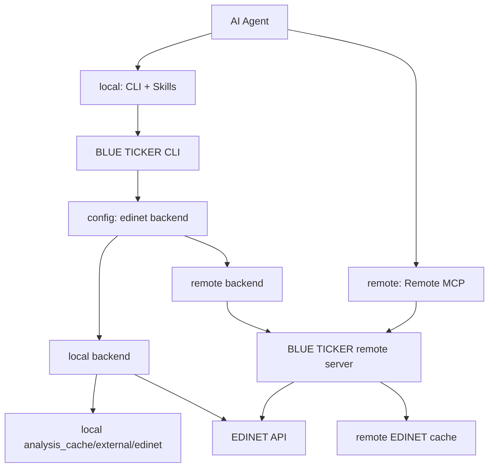

# リモートMCP移行とキャッシュ抽象化ロードマップ

作成日: 2026-05-06
最終更新: 2026-05-30

この文書は、将来的にローカルMCPを廃止し、リモートMCPへ移行するための設計ロードマップです。ローカルCLIとローカルキャッシュは廃止対象ではなく、CLI + Skills でAIエージェントがローカル操作する経路として残します。

## ゴール

- ローカルMCPは段階的に廃止する。
- ローカルCLIは継続し、AIエージェントは Skills 経由でCLIを操作できるようにする。
- EDINET APIとの直接通信は、将来的に外部サーバーへ移管できるようにする。
- CLIはローカルキャッシュとリモートキャッシュを設定で選べるようにする。
- 既存のローカルキャッシュ機能は正式な backend として残し、リモート backend と並行運用できるようにする。

## 非ゴール

- `ticker analyze` などの各サブコマンドに backend 選択オプションを増やさない。
- `CacheManager` とEDINET external cacheを無理に単一抽象へ統合しない。
- リモートMCP移行と同時に、既存のCLI出力契約やキャッシュ形式を大きく変えない。
- ローカルキャッシュを「レガシー」として扱わない。

## 将来構成



## Backend 方針

backend はCLIの個別サブコマンドではなく、設定で選択する。

| backend | 用途 | 認証 | EDINET API通信 | キャッシュ |
|---|---|---|---|---|
| `local` | 現行CLI互換。ローカル運用 | EDINET APIキー | CLIプロセスが直接実行 | ローカル `analysis_cache/external/edinet` |
| `remote` | リモートMCP/外部サーバー運用 | OAuthなどのremote server認証 | remote serverが実行 | サーバー上のremote cache |

初期値は `local` とする。`hybrid` は便利だが、データ鮮度や再現性が曖昧になりやすいため、最初のremote実装では見送る。必要になった場合は、remote優先・local fallbackなどの明確なポリシーを別途設計する。

設定イメージ:

```bash
ticker config set edinet-backend local
ticker config set edinet-key <EDINET_API_KEY>

ticker config set edinet-backend remote
ticker config login
```

## 現在地

### EDINET キャッシュ境界（Phase 1 完了）

| ファイル | 役割 |
|---|---|
| `blue_ticker/api/edinet_cache_backend.py` | `EdinetCacheBackend`。EDINET external cacheの差し替え境界 |
| `blue_ticker/api/edinet_cache_store.py` | `EdinetCacheBackend` のローカルファイル実装 |
| `blue_ticker/api/edinet_client.py` | 具象 `EdinetCacheStore` ではなく `EdinetCacheBackend` を受け取る |
| `tests/test_edinet_client.py` | メモリbackendを差し込み、抽象境界で動くことを確認 |

### MCP サーバー初期実装（Phase 4 一部着手）

自己ホスト・認証なし・共有データストア方式で `mcp_server/` モジュールを新設した。
詳細は `docs/mcp-server-plan.md` を参照。

| ファイル | 役割 |
|---|---|
| `blue_ticker/mcp_server/server.py` | FastMCP エントリポイント。`blt-server` コマンドで起動 |
| `blue_ticker/mcp_server/tools/search.py` | `search_companies`、`search_by_sector` ツール |
| `blue_ticker/mcp_server/tools/filings.py` | `get_filings` ツール |
| `blue_ticker/mcp_server/tools/financial.py` | `get_financial_summary` ツール |
| `blue_ticker/mcp_server/tools/filing_content.py` | `get_filing_content` ツール |
| `blue_ticker/mcp_server/sync/document_list.py` | `sync_document_list`。Stage 1 バッチ（書類一覧差分更新） |

`mcp` パッケージは `[dependency-groups].server` にのみ追加。CLI バイナリには含まれない。
トランスポートは `streamable-http`。

## フェーズ計画

### Phase 1: 抽象化の定着

目的: ローカル実装を壊さず、リモート実装を差し込める境界を安定させる。

- `EdinetCacheBackend` をEDINET external cacheの正式境界として扱う。
- `EdinetCacheStore` はローカルbackend実装として残す。
- `EdinetAPIClient` からローカルファイルI/O前提を増やさない。
- 新しいEDINET external cache操作は、まず `EdinetCacheBackend` に必要性を確認してから追加する。
- `tests/test_edinet_client.py` でローカル以外のbackend差し込みを継続的に検証する。

完了条件:

- `poetry run pyright blue_ticker/` が通る。
- `poetry run pytest` が通る。
- ローカルCLIの既存挙動が変わらない。

### Phase 2: config設計

目的: backend選択と認証設定をCLI設定に導入する。

- `SettingsStore` に `edinetBackend` を追加する。初期値は `local`。
- 許可値はまず `local` / `remote` の2択にする。
- `local` では EDINET APIキーを使う。
- `remote` では EDINET APIキーではなく、remote server認証を使う。
- `config show` では backend と認証状態を明示する。
- `config init` は backend 選択に応じて、EDINET APIキー設定またはremote login導線を出す。

注意点:

- backend選択用のサブコマンドは追加しない。
- analyze/filings/filing/cacheなど各サブコマンドに `--edinet-backend` は追加しない。
- OAuthの具体実装前は、remote backendを選べても「未対応」と分かる戻り値にするか、設定保存のみ先行する。

### Phase 3: remote backend 最小実装

目的: CLIがEDINET APIへ直接アクセスせず、remote serverから同等のデータを取得できるようにする。

- `RemoteEdinetCacheBackend` を追加する。
- remote serverとの通信は標準ライブラリまたは既存依存で実装する。新規依存が必要な場合は事前確認する。
- remote backendは以下の操作を提供する。
  - 日別書類一覧の取得
  - 年次書類インデックスの取得
  - XBRL packageの取得
  - XBRLをローカル解析用ディレクトリへmaterializeする処理
- XBRL解析コードは当面 `Path` ベースを維持する。remoteから取得したXBRLも、CLI側の一時またはartifact cacheに展開して既存解析器へ渡す。

注意点:

- remote backendではCLIからEDINET APIキーを使わない。
- remote cacheのTTLや更新方針はサーバー側で管理する。
- CLI側にはremoteから取得したXBRL artifactの短期キャッシュだけを置く設計を優先する。

**自己ホスト版の例外**: サーバーと CLI が同一マシン上にある場合は `RemoteEdinetCacheBackend` を経由せず、
サーバーが書いたデータストアをローカルファイルとして直接読む（共有データストア方式）。
Phase 3 の HTTP 通信実装はサーバーを別マシンへ移す時点で改めて対応する。

### Phase 4: remote MCP 導入（進行中）

目的: MCP利用時のEDINET処理をremote server側へ寄せる。

- remote MCPはremote server上のキャッシュとEDINET取得機能を使う。
- remote MCPの公開機能とパラメーターは、CLIの公開機能を基準に設計する。
- remote MCPは、ローカルの `analysis_cache` を直接操作しない。
- キャッシュ削除系は引き続き慎重に扱う。remote MCPから破壊的な削除操作を出す場合は、別途安全設計を行う。

**実装済み（2026-05-30）**:

- `blue_ticker/mcp_server/` に FastMCP サーバーを新設。`blt-server` コマンドで起動。
- MCP ツール 5 本（`search_companies`、`search_by_sector`、`get_filings`、`get_financial_summary`、`get_filing_content`）。
- 書類一覧の定期同期バッチ（`sync_document_list`）。
- 財務指標計算はサーバー側（`data_service` + `analyzer.py` 経由）で実行し、算出済みデータを返す。

**残タスク**:

- CLI を算出済みデータの受け取り・整形に特化させる（現状は data_service を直接呼ぶ）。
- `mcp` パッケージのインストール（`poetry add --group server "mcp>=1.0.0,<2.0.0"`）。
- `sync_document_list` の定期実行設定（cron 等）。
- `tests/test_dependency_rules.py` に `mcp_server` レイヤーのルールを追加。

完了条件:

- remote MCPで主要機能が動作する。
- CLIは `local` / `remote` backendを設定で選択できる。
- ローカルMCPなしでも、AIエージェントのローカル操作は CLI + Skills で成立する。

### Phase 5: ローカルMCP廃止（完了）

目的: MCPの運用経路をremoteへ寄せ、ローカルMCPの保守負荷を下げる。

- ローカルMCP機能の起動・インストール導線を削除済み。
- CLI + Skills のローカル操作導線を残す。
- remote MCPは将来の外部サーバー運用としてローカルCLIとは分離する。

削除済み:

- `ticker mcp start`
- `ticker mcp install-*`
- ローカルMCPサーバー固有の設定・テスト

残すもの:

- BLUE TICKER CLI本体
- ローカル `EdinetCacheStore`
- `analysis_cache/derived` と `analysis_cache/external/edinet` のローカル運用
- SkillsからCLIを操作する運用

## 設計上の判断

### ローカルキャッシュは正式backendとして残す

ローカルキャッシュは、リモート移行後もCLI利用時の正式backendとする。EDINET APIキーをローカルに置き、CLIが直接EDINET APIへアクセスする使い方は残す。

### EDINET external cache と derived cache は分ける

EDINET external cacheは外部取得物、derived cacheはBLUE TICKER生成物であり、TTL、バージョン、削除ポリシーが異なる。したがって、現時点では `EdinetCacheBackend` と `CacheManager` を統合しない。

### XBRLはローカルPathへmaterializeする

既存のXBRL解析器はローカルディレクトリを読む。remote backendでも最終的にはローカルPathを返せるようにし、解析器側をremote awareにしない。

### backend選択はconfigで行う

サブコマンドごとに backend option を足すとCLIの表面積が増える。通常利用ではbackendは環境・認証に紐づくため、`config` に集約する。

### 自己ホスト版では共有データストア方式を採用する

サーバーと CLI が同一マシン上にある場合、CLI は MCP サーバーへ HTTP 通信せず、
サーバーが書いたデータストア（既存の `analysis_cache/` と同じ構造）をローカルファイルとして直接読む。
`mcp` パッケージは CLI バイナリに含めない。サーバーを別マシンへ移す段階で Phase 3 の HTTP 通信実装を追加する。

### 計算ロジックはサーバー側で実行する

財務指標計算（YoY 差分・ROE・ROIC・WACC 等）は MCP サーバーが担い、CLI はその結果を整形・表示するレンダラーとして特化する。
これにより CLI とチャットボットが同じ計算結果を参照でき、数値の一貫性が保たれる。
現在の `services/analyzer.py` はサーバー側の `data_service` 経由で呼ばれる。

## 未決事項

- ~~remote serverのAPI設計~~ → MCPツールインターフェース確定済み（`docs/mcp-server-plan.md` 参照）
- OAuthフローとトークン保存場所
- ~~remote cacheのTTL、更新方針~~ → Stage 1 は `EdinetCacheStore` の既存 TTL を踏襲。Stage 2 以降は別途設計
- remote cache 削除ポリシー
- remote backend利用時の `ticker cache status` 表示内容
- remote XBRL artifactをローカルにどれくらい保持するか（サーバー別マシン化時）
- local/remote間で分析結果キャッシュ `derived/` を共有するか、backendごとに分けるか

## 関連ドキュメント

- `docs/mcp-server-plan.md` — MCPサーバーの具体的な実装状況と TODO（本ドキュメントの下流）
- `docs/architecture-review.md`
- `docs/architecture-status.md`
- `.agents/rules/project/caching.md`
- `.agents/rules/project/mcp-cli-parity.md`
